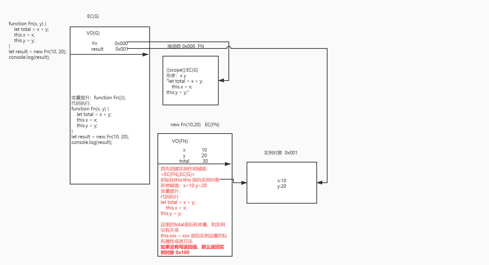

## 编程语言

- 面向对象 OOP（ java js php c++ 等等）
- 面向过程 POP (c)

## 面向对象编程

面向对象编程主要包括三大类

- 对象：万物皆对象(泛指)
- 类：对“对象”的划分（按照其功能结构特点划分 比如 人可以分为 男人和女人）
- 实例：类中的具体事物

JS 本身是基于面向对象开发出来的编程语言，所以我们使用 JS 的时候要有面向对象的思维方式处理问题

- 内置类

  - 每一种数据类型都有一个所属的内置类：Number(每个数字，NaN 都是它的实例) Sting/Boolean / Array 等等。。。。

  - 每一种 DOM 元素也有自己所属的类

    window -> Window -> WindowProperties -> EventTarget -> Object

    document -> HTMLDocument -> Document -> Node -> EventTarget -> Object

    .......

    学习数组，首先分析一个数组（实例），研究清楚这个实例特征后（结构特点以及常用方法），再遇到其他数组，也按照相同的机制处理

- 自定义类

  创建一个函数 fn

  - fn() 普通函数执行（堆栈机制）
  - new fn() 构造函数（堆栈机制 + 面向对象机制）

```js
// 分析一下自定义类的机制过程
function Fn(x, y) {
  let total = x + y;
  this.x = x;
  this.y = y;
}
let result = new Fn(10, 20);
console.log(result);
```



new 函数(): 构造函数执行，和普通函数的区别

- 相似点
  - 一样是把函数执行（传递参数也一样）
  - 形成私有上下文
  - 变量提升
- 不同点
  - new 执行，浏览器会在当前上下文中，默认创建一个对象（实例对象）
  - 在初始化this的时候，this执行这个实例
    - 代码中编写 this.xxx = xxx 的操作，都是给实例对象设置私有属性
    - 除了this.xxx = xxx 其余的操作全部和实例对象没有关系
  - 函数如果没有返回值，或者返回值是基本类型，则默认返回创建的实例对象，如果返回的是引用类型，那么以返回的引用类型为主

构造函数执行（函数被称为类，返回结果被成为实例）

```js
function Fn() {
    /*
     * EC(FN)
     *   初始创建Fn找个类的一个实例对象  0x000
     *   初始THIS:this->0x000
     */
    let total = 0; //上下文的私有变量  和实例对象没有必然的联系
    this.x = 10; //this.xxx=xxx 都是给实例对象设置的私有属性和方法
    this.y = 20;
    this.say = function () { //0x000.say=0x100   0x001.say=0x101
        console.log('SAY');
    };
    /* 如果不设置返回值，或者返回值是一个基本类型值，默认都会把实例对象 0x000 返回；如果手动返回的是一个引用数据类型值，则以自己返回的为主； */
    // return {
    //     name: 'zhufeng'
    // };
}
let f1 = new Fn(); //->0x000
let f2 = new Fn; //->0x001  new执行的时候，如果类不需要传递实参吗，可以不用加小括号（不加小括号，叫做无参数列表new；设置小括号，叫做带参数列表new；除了师是否传递参数的区别，在运算的优先级上也有区别？ new Fn->19  new Fn()->20）
// 每一次new都是把函数重新执行（重新形成一个新的私有上下文、重新创建一个实例对象、代码重新执行...）
// console.log(f1, f2, f1 === f2); //=>false
```

## 检测成员

检测成员是否属于这个对象或者是否属于这个对象的私有属性

- in :检测成员是否属于这个对象（` 'dd' in window`）检测公有属性和私有属性，如果存在则为true
- hasOwnProperty:检测成员的私有属性（`f1.hasOwnProperty('say')`）只有私有属性才为true

如何检测一个成员是公有属性而不是私有属性

```js
// obj:要检测的对象
// attr:要验证的成员
 function hasPubProperty(obj, attr) {
    // 思路一：是它的属性 但是还不是私有的，那么一定是公有的「BUG：如果某个属性即使私有的，也是公有的，则检测出来的结果是不准确的」
    // return (attr in obj) && (!obj.hasOwnProperty(attr));
    
    // 思路二：真正的思路应该是检测原型上的属性，因为原型上的属性都是公有的
    // Object.getPrototypeOf:获取当前对象的原型
    let proto = Object.getPrototypeOf(obj);
    while (proto) {
        // 依次查找原型链，直到找到Object.prototype为止
        if (proto.hasOwnProperty(attr)) {
            return true;
        }
        proto = Object.getPrototypeOf(proto);
    }
    return false;
} 
```

