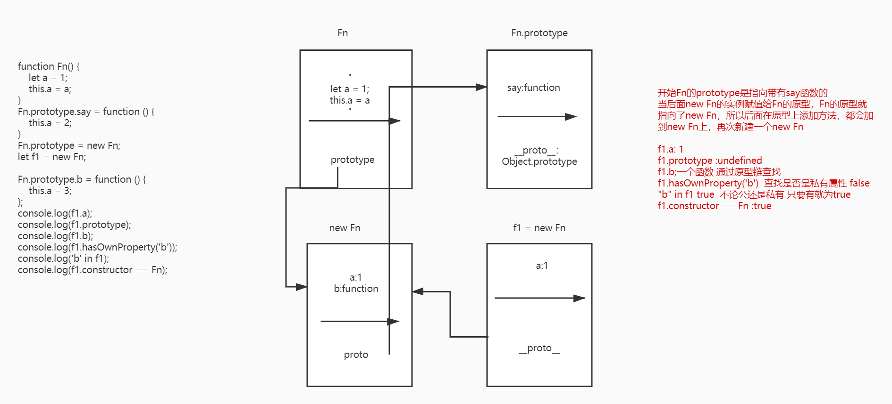
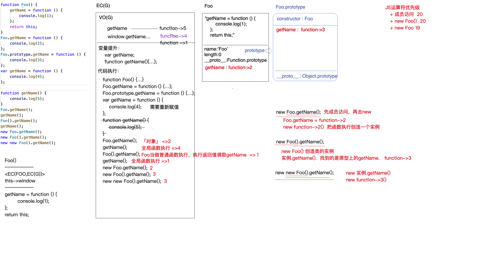

## 第一题

```js
function C1(name) {
  if (name) {
    this.name = name;
  }
}
function C2(name) {
  this.name = name;
}
function C3(name) {
  this.name = name || "join";
}
C1.prototype.name = "Tom";
C2.prototype.name = "Tom";
C3.prototype.name = "Tom";
alert(new C1().name + new C2().name + new C3().name);
```

## 第二题

```js
function Fn() {
    let a = 1;
    this.a = a;
}
Fn.prototype.say = function () {
    this.a = 2;
}
Fn.prototype = new Fn;
let f1 = new Fn;
​
Fn.prototype.b = function () {
    this.a = 3;
};
console.log(f1.a);
console.log(f1.prototype);
console.log(f1.b);
console.log(f1.hasOwnProperty('b'));
console.log('b' in f1);
console.log(f1.constructor == Fn);
```

## 第三题

```js
function Foo() {
  getName = function () {
    console.log(1);
  };
  return this;
}
Foo.getName = function () {
  console.log(2);
};
Foo.prototype.getName = function () {
  console.log(3);
};
var getName = function () {
  console.log(4);
};
function getName() {
  console.log(5);
}
Foo.getName();
getName();
Foo().getName();
getName();
new Foo.getName();
new Foo().getName();
new new Foo().getName();
```

## 第四题

```js
let n = 10;
let m = n.plus(10).minus(5);
console.log(m); //=>15（10+10-5）
```

## 第五题

```js
// 使用es6 语法 class 修改下面的代码
function Modal(x, y) {
  this.x = x;
  this.y = y;
}
Modal.prototype.z = 10;
Modal.prototype.getX = function () {
  console.log(this.x);
};
Modal.prototype.getY = function () {
  console.log(this.y);
};
Modal.n = 200;
Modal.setNumber = function (n) {
  this.n = n;
};
let m = new Model(10, 20);
```

## 第六题

```js
let obj = {
  2: 3,
  3: 4,
  length: 2,
  push: Array.prototype.push,
};
obj.push(1);
obj.push(2);
console.log(obj);
```

## 第七题

```js
var a = ?;
if (a == 1 && a == 2 && a == 3) {
    console.log('OK');
}
```

---

## 答案和分析

```js
// 第一题
// C1 new C1().name  没有传入name 因为有if判断，所以C1没有私有属性name,这个时候要向原型上查找  所以为 Tom
// C2 c2也没有传入name 但是还是设置this.name = undefined 所以 C2是undefined
// C3 C3添加了一个或 所以this.name = "join"
// 最后字符串拼接 答案是 Tomundefinedjoin
```

```js
// 第二题 看图分析
```



```js
// 第三题 看图分析
```



```js
// 第四题
// 检查是不是数字
var validate = function validate(x) {
  x = +x;
  return isNaN(x) ? 0 : x;
};
Number.prototype.plus = function plus(x) {
  x = validate(x);
  // this都是对象数据类型的值  this->10/new Number(10)
  return this + x;
};
Number.prototype.minus = function minus(x) {
  x = validate(x);
  return this - x;
};

let n = 10;
let m = n.plus(10).minus(5);
console.log(m); //=>15（10+10-5）
```

```js
// 第五题
class Modal {
  constructor(x, y) {
    this.x = x;
    this.y = y;
  }
  getX() {
    console.log(this.x);
  }
  getY() {
    console.log(this.xy);
  }
  static n = 200;
  static setNumber(n) {
    this.n = n;
  }
}
Modal.prototype.z = 10;
```

```js
// 第六题
let arr = [10, 20];
arr.push(30);
// Array.prototype.push 每次都向数组最后一位添加一位，并且数组累加
Array.prototype.push = function (value) {
  // this == arr
  // 把value 放在数组最后一位 this[this.length] = value
  // length 累加
  // 返回累加后的数组长度
};

let obj = {
  2: 3,
  3: 4,
  length: 2,
  push: Array.prototype.push,
};
obj.push(1); // this == obj value=1  length长度是2因为对象里面有定义length  obj[2] = 1 obj.length = 3
obj.push(2); // this == obj value=2  obj[3] = 2 obj.length = 4
console.log(obj); // {2:1,3:2,length:4,push:function}
```

```js
// 第七题 a = ? 才符合判断
/*
=== 绝对相等 必须类型和值都相等才可以相等
== 相等 左右两边类型不同，会先转化为相同的类型再比较
   对象 == 字符串 对象转字符串
   null == undefined 相等 但是和其他值都不相等
   NaN == NaN false NaN 和谁都不相等
   其他的都是转化为数字比较

对象 转 数字或者字符串
     先调取属性 Symbol.toPrimitive
     没有这个属性 再去调取valueOf 获取原始值（基本类型）
     没有原始值 再去调用toString 变成字符串
     如果最后是转化成数字 再去调用Number 把字符串转化为数字
*/
let obj = {};
var a = {
  i: 0,
};
// Symbol.toPrimitive 可以替换为 valueOF  或者 toString 本质上都一样
a[Symbol.toPrimitive] = function (hint) {
  // this==a
  return ++this.i;
};
a.valueOf = function (hint) {
  // this==a
  return ++this.i;
};
a.toString = function (hint) {
  // this==a
  return ++this.i;
};

// 数据劫持
//   + 在全局上下文中基于var/function声明变量，相当于给window设置对应的属性  -> window.a
//   + Object.defineProperty劫持对象中某个属性的获取和设置等操作
var i = 0;
Object.defineProperty(window, "a", {
  get() {
    // 获取window.a的时候触发getter函数
    return ++i;
  },
  // set(value) {
  //     // 设置window.a属性值的时候触发setter函数
  // }
});
if (a == 1 && a == 2 && a == 3) {
  console.log("OK");
}
```
