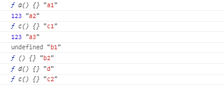

# js 预编译是什么

## 先看一段代码

```js
// 函数
function fn(a, c) {
  console.log(a, "a1");
  var a = 123;
  console.log(a, "a2");
  console.log(c, "c1");
  // 函数声明
  function a() {}
  console.log(a, "a3");
  console.log(b, "b1");
  // 函数表达式
  var b = function () {};
  console.log(b, "b2");
  // 函数声明
  console.log(d, "d");
  function d() {}
  function c() {}
  console.log(c, "c2");
}
//调用函数
fn(1, 2);
```

你知道上面代码的执行结果，如果你不复制代码到浏览器中看结果，那么我相信你已经理解了预编译，也就不用再看下去了，如果你不知道结果，那么你可以尝试看下去。相信你会有所收获。

## 什么是预编译

预编译分为全局预编译和局部预编译，上面的代码就是局部预编译，全局预编译发生在页面加载完成时候执行，而局部预编译发生在函数执行前。

全局预编译步骤

- 创建 GO 对象（全局对象）
- 找变量声明，将变量名作为 GO 属性名，值为 undefined
- 查找函数声明，作为 GO 属性，值赋值给函数体

局部预编译步骤

- 创建 AO 对象（执行上下文）
- 找形参和变量声明，将变量和形参作为 AO 属性名，值为 undefined
- 将实参值和形参值统一
- 在函数体里面找函数声明，值赋值给函数体

## 逐步分析代码

```js
// 开始会创建 AO 局部编译对象
AO:{

}
// 然后查找形参和变量声明作为 AO的属性并且赋值为undefined
// 因为 function d(){} 是函数体 要到最后一步才查找
AO:{
    a:undefined,
    c:undefined,
    b:undefined,
}
// 将形参和实参的值统一 赋值给AO对应的属性
AO:{
   a:1,
   c:2,
   b:undefined
}
// 在函数体里找函数声明，值赋值给函数体（如果函数声明和变量一样，那么会覆盖变量声明）
// 因为 b 是函数表达式，不是函数声明，所以此时b还是undefined
AO:{
  a:function a(){},
  c:function c(){},
  b:undefined,
  d:function d(){}
}
```

```js
// 执行到这里接下来就要开始 js解释执行，也就是逐行执行代码
// 函数
function fn(a, c) {
  console.log(a, "a1");
  var a = 123;
  console.log(a, "a2");
  console.log(c, "c1");
  // 函数声明
  function a() {}
  console.log(a, "a3");
  console.log(b, "b1");
  // 函数表达式
  var b = function () {};
  console.log(b, "b2");
  // 函数声明
  console.log(d, "d");
  function d() {}
  function c() {}
  console.log(c, "c2");
}
//调用函数
fn(1, 2);
// 预编译结果
AO:{
  a:function a(){},
  c:function c(){},
  b:undefined,
  d:function d(){}
}
// 首先执行console.log(a,'a1')
function a(){} "a1"
// 接下来 a赋值变成123 AO 的属性 a就变成了123
// 打印a2
123 "a2"
// 打印c1
function c(){} "c1"
// 打印a3 此时AO属性的 a值依然是123
123 "a3"
// 打印 b1 此时b是undefined

undefined "b1"
// 这个时候函数 function (){} 赋值给b 所以AO属性的b 为 function(){}
// 打印 b2
function(){} 'b2'
// 打印 d
function d(){} "d"
// 打印c2
function c(){}  "c2"
```

最终答案

;

## 全局预编译

全局预编译根据相对应的步骤逐步分析即可
