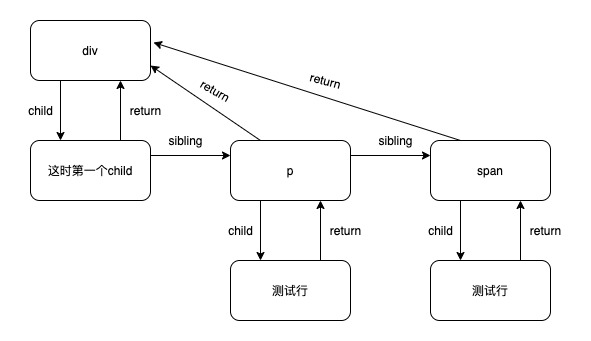

## fiber 数据结构

fiber 自带的部分属性

```js
const fiber = {
  // 类型 例如 原生标签  函数组件 类组件等
  type: vnode.type,
  key: vnode.key,
  // 属性
  props: vnode.props,
  // 原生标签 对应真实的dom节点
  // class 对应的是实例
  stateNode: null,
  // 第一个子fiber
  child: null,
  // 下一个兄弟节点  和child 同在一个层级 比如 和child在一个div中
  sibling: null,
  // 指向对应的父节点
  return: null,
  // 记录节点在当前层级的位置
  index: null,
};
```

看这段代码 对应的 fiber 结构是什么样子的

```js
<div>
  这是第一个child
  <p>测试行</p>
  <span>测试行</span>
</div>
```


