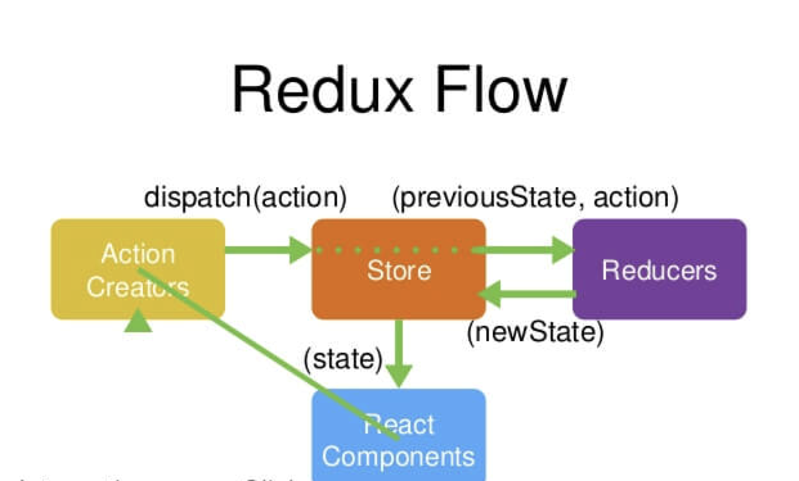
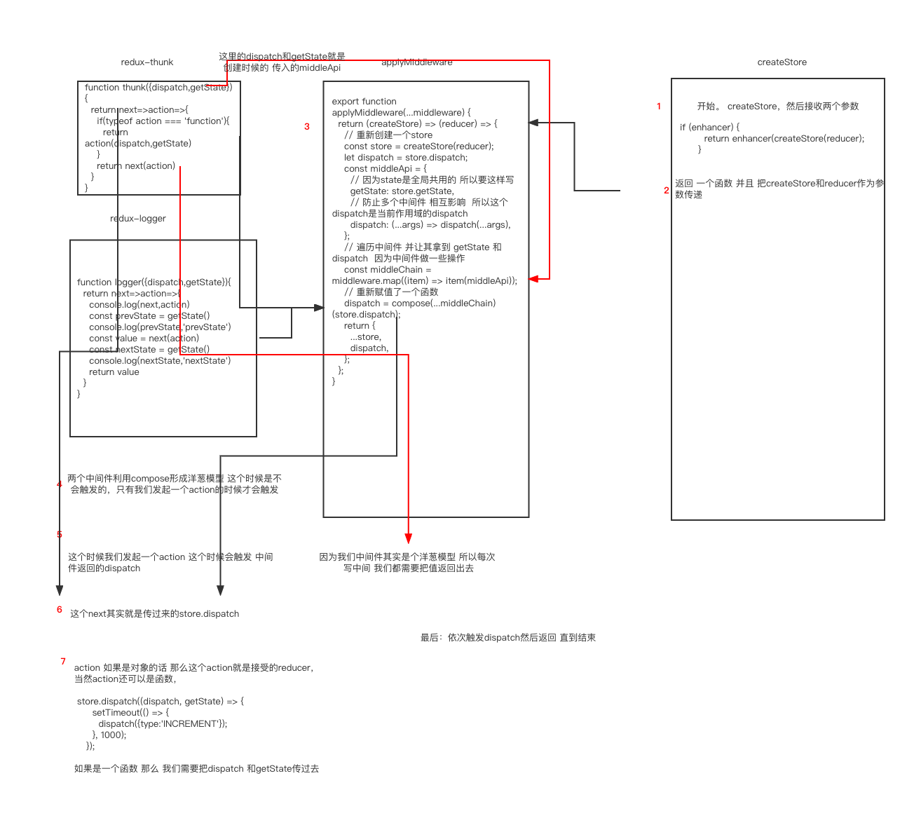

## 安装

`npm install --save redux`

本文只写 redux 关于 react-redux 后面的文章会单独去写

## 概念



先看这张图，按照步骤先解释一下 然后有个概念

- 首先用户发起一个 action（使用 dispatch）

- 然后 store 掉起一个 reducer 传入两个参数 当 state 接收到 action 然后会返回一个新的 state

- 一但产生新的 state 那么我们需要及时去通知 监听者

## API

- store 是保存数据的地方 我们可以看成一个容器 整个应用只能有一个 store。

store 是靠 redux 提供的 createStore 生成的

```jsx
import { createStore } from "redux";

function counter(state = 0, action) {
  switch (action.type) {
    case "INCREMENT":
      return state + 1;
    case "DECREMENT":
      return state - 1;
    default:
      return state;
  }
}

let store = createStore(counter);
```

- store.dispatch 是触发 action 的唯一方法

- store.subscribe 是用来注册监听 一旦 state 发生变化 那么我们要更新页面数据

- action 是一个对象 其中 type 属性是必须的，代表 action 的名字

```js
const action = {
  type: "INCREMENT",
  payload: 1,
};
```

- reducer 是一个纯函数 ，纯函数的一个特征 同样的输入 一定会有同样的输出

## 看个例子 学习 redux 的基本用法

看不懂的也可以去官方的 demo 学习理解

```jsx
import React from "react";
import { createStore } from "redux";

// 创建一个reducer
function counter(state = 0, action) {
  switch (action.type) {
    case "INCREMENT":
      return state + 1;
    case "DECREMENT":
      return state - 1;
    default:
      return state;
  }
}
// 创建一个store
let store = createStore(counter);

class ReduxDemo extends React.Component {
  add = () => {
      // 触发action
    store.dispatch({ type: "INCREMENT" });
  };
  componentDidMount() {
      // 注册监听
    this.unsubscribe = store.subscribe(() => {
        // 更新render
      this.forceUpdate();
    });
  }
  componentWillUnmount() {
      // 销毁注册
    if (this.unsubscribe) {
      this.unsubscribe();
    }
  }
  render() {
    return (
      <div>
         {// 获取state}
        <div>{store.getState()}</div>
        <button onClick={this.add}>这是+1的按钮</button>
      </div>
    );
  }
}

```

## 实现一个自己的 redux

先实现基本的功能 然后再逐渐完善

- 第一步 创建一个 `createStore` 函数

createStore 函数 返回一个对象 分别是 getState dispatch subscribe

```js
export function createStore(reducer) {
  let currentState;
  let currentListeners = [];

  function getState() {}

  function dispatch(action) {}
  function subscribe(listener) {}

  return {
    getState,
    dispatch,
    subscribe,
  };
}
```

然后我去实现函数的功能 getState 是获取当前 state 所以我们直接返回当前定义的 currentState 即可

- getState

```js
function getState() {
  return currentState;
}
```

注册是收集监听者 注意有注册就要有解绑

- subscribe

```jsx
function subscribe(listener) {
  currentListeners.push(listener);
  return () => {
    const index = currentListeners.indexOf(listener);
    currentListeners.splice(index, 1);
  };
}
```

触发 action

- dispatch

```js
// reducer是createStore接收的一个reducer
function dispatch(action) {
  currentState = reducer(currentState, action);
  currentListeners.forEach((item) => item()); // 通知监听者
}
```

这样一个简易的 redux 就写好了

代码汇总

```js
function createStore(reducer) {
  let currentState;
  let currentListeners = [];

  function getState() {
    return currentState;
  }

  function dispatch(action) {
    console.log(reducer, action, "reducer");
    currentState = reducer(currentState, action);
    currentListeners.forEach((item) => item());
  }
  function subscribe(listener) {
    currentListeners.push(listener);
    return () => {
      const index = currentListeners.indexOf(listener);
      currentListeners.splice(index, 1);
    };
  }
  // 这一步是为了让当前的state有初始值 type可以随意设置  只要保证不会和外部冲突即可
  dispatch({ type: "redux/1235" });

  return {
    getState,
    dispatch,
    subscribe,
  };
}
```

感兴趣的可以自己试试

## 中间件 applyMiddleware

redux 身的功能是有限的，比如我们发起一个 action 要异步执行 这个时候 我们就需要借助中间件 引入插件才可以

```js
import thunk from "redux-thunk"; // 支持异步
import logger from "redux-logger"; // 打印日志
let store = createStore(counter, applyMiddleware(thunk, logger));
```

applyMiddleware 是一个函数 并且接受参数 这个参数是不固定的，接下来我们实现一下

```js
function compose(...fun) {
  // 这个空数组的兼容情况
  if (fun.length === 0) {
    return (arg) => arg;
  }
  if (fun.length === 1) {
    return fun[0];
  }
  // 这个返回值是个函数，这个函数执行的时候，会按照顺序挨个执行
  return fun.reduce(
    (a, b) =>
      (...args) =>
        a(b(...args))
  );
}

export function applyMiddleware(...middleware) {
  return (createStore) => (reducer) => {
    // 重新创建一个store
    const store = createStore(reducer);
    let dispatch = store.dispatch;

    const middleApi = {
      // 因为state是全局共用的 所以要这样写
      getState: store.getState,
      // 防止多个中间件 相互影响  所以这个dispatch是当前作用域的dispatch
      dispatch: (...args) => dispatch(...args),
    };

    // 遍历中间件 并让其拿到 getState 和dispatch  因为中间件做一些操作
    const middleChain = middleware.map((item) => item(middleApi));

    // 重新赋值了一个函数
    dispatch = compose(...middleChain)(store.dispatch);

    return {
      ...store,
      dispatch,
    };
  };
}

// 这个时候别忘了 createStore函数需要改造一下

export function createStore(reducer, enhancer) {
  if (enhancer) {
    return enhancer(createStore)(reducer);
  }
  // ....省去部分代码
}
```

看下`compose`主要的作用

```js
function compose(...funcs) {
  console.log(funcs, "funcs");
  if (funcs.length === 0) {
    return (arg) => arg;
  }

  if (funcs.length === 1) {
    return funcs[0];
  }

  return funcs.reduce(
    (a, b) =>
      (...args) =>
        a(b(...args))
  );
  /*
  返回一个函数 并且函数把接受的中间件（实际上就是函数） 以洋葱的结构返回
   ƒ () {
    return a(b(...arguments));
  }
  */
}
```

我们再来看下 redux-thunk 和 redux-logger 实现 来加强一下理解

redux-thunk

```js
function thunk({ dispatch, getState }) {
  return (next) => (action) => {
    if (typeof action === "function") {
      return action(dispatch, getState);
    }
    return next(action);
  };
}
```

redux-logger

```js
function logger({ dispatch, getState }) {
  return (next) => (action) => {
    console.log(next, action);
    const prevState = getState();
    console.log(prevState, "prevState");
    const value = next(action);
    const nextState = getState();
    console.log(nextState, "nextState");
    return value;
  };
}
```

整个中间件过程 都是对 dispatch 的加强

我们用流程图来看下中间件的流程



## combineReducers

来看下最后一个 api 如果我们只有一个 reducer 的话 那么无疑我们的这个 reducer 会很难移维护，所以 combineReducers 可以帮我们把多个 reducer 合并

用法

```js
let store = createStore(
  combineReducers({ count: counter }),
  applyMiddleware(thunk, logger)
);
```

看下简单的实现

```js
const combineReducers = (reducers) => {
  return (state = {}, action) => {
    return Object.keys(reducers).reduce((nextState, key) => {
      nextState[key] = reducers[key](state[key], action);
      return nextState;
    }, {});
  };
};
```

其实也很好理解 reducers 就是 `{ count: counter }` 这个对象 然后返回一个函数 本质上这个函数其实就是一个 reducer

接收一个 state 和 action

每次触发 action 的时候 `Object.keys(reducers)` 获取到 `key` 然后遍历 把对应的 state 和 action 传入到你对应的 reducers 里面 然后返回赋值 最后返回结果

到这里 整个 redux 大致流程 基本上就是这样 其实里面还有一些 细节 但是整体的思想就是这样

如果有错误 欢迎指正
