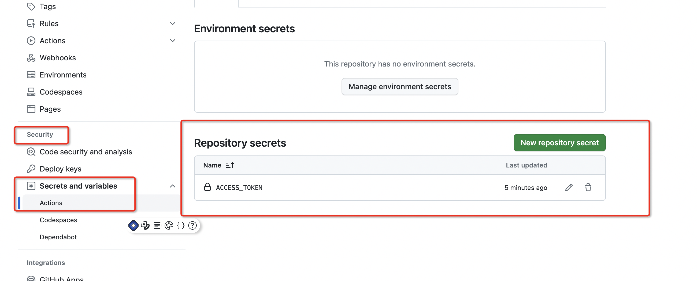

# 前端工程化规范 一

## 项目初始化

我们使用的lerna+pnpm来管理多包工具

创建文件夹，例如sd-fe-eng，然后使用 [lerna](https://www.lernajs.cn/) 来初始化项目, 初始化命令如下

```js
lerna init
```

执行后会生成一些文件夹，文件暂时先不用管，后续使用会再详细说明
根目录创建文件 `pnpm-workspace.yaml`, 输入一下内容

```js
packages:
  - 'packages/*'
```

初始化完成 接下来我们开始 `vuepress` 文档的初始化

## vuePress 初始化

可以参考官网 [VuePress](https://v2.vuepress.vuejs.org/zh/guide/getting-started.html#%E6%89%8B%E5%8A%A8%E5%AE%89%E8%A3%85)

也可以参考以下步骤
首先使用 pnpm 安装相关插件

- 安装插件

```js
pnpm add -D vuepress@next @vuepress/client@next vue -w
// -w 意思是在根目录安装 因为我们是一个lerna 管理的多包项目
```

- 在package.json中添加脚本。

```js
    {
        "scripts": {
            "docs:dev": "vuepress dev docs",
            "docs:build": "vuepress build docs"
        }
    }
```

- 将默认的临时目录和缓存目录添加到 .gitignore 文件中。

    ```js
        echo 'node_modules' >> .gitignore
        echo '.temp' >> .gitignore
        echo '.cache' >> .gitignore
    ```

- 创建文件夹 docs
然后在 docs文件夹中创建文件夹 `.vuepress`,再创建一个 `index.md` 文件 输入以下内容 测试使用

```md
---
home: true
# heroImage: img/logo.png
heroText: Hero 标题
tagline: Hero 副标题
actionText: 快速上手 →
actionLink: /zh/guide/
features:
- title: 简洁至上
  details: 以 Markdown 为中心的项目结构，以最少的配置帮助你专注于写作。
- title: Vue驱动
  details: 享受 Vue + webpack 的开发体验，在 Markdown 中使用 Vue 组件，同时可以使用 Vue 来开发自定义主题。
- title: 高性能
  details: VuePress 为每个页面预渲染生成静态的 HTML，同时在页面被加载的时候，将作为 SPA 运行。
footer: MIT Licensed | Copyright © 2018-present Evan You
---
```

在`.vuepress`文件夹中创建public文件夹用来放置一些公共资源例如 logo, 然后再在`.vuepress`文件夹中创建 `config.js`配置文件，以下内容作为参考。

```js
import { defaultTheme } from 'vuepress'


export default {
  lang: 'zh-CN',
  title: '前端规范工程化',
  description: '这是我的第一个 VuePress 站点',
  base: '/sd-fe-eng/',
  theme: defaultTheme({
    logo: '/img/logo.png',// 这个就是指public中的文件路径
  })
}
```

至此，文档已经初始化完成，可以执行 `npm run docs:dev` 启动文档。查看效果。

下一步我们要在github上能够自动化部署项目。

## action自动化部署

- Workflows（工作流程）
持续集成的运行过程称为一次工作流程，也就是我们项目开始自动化部署到部署结束的这一段过程可以称为工作流程，一个工作流程中由一个或者多个任务（job）组成。

- Jobs（任务）
一个工作流程中包含多个任务，简单来说就是一次自动部署的过程中，需要完成一个或多个任务，这些任务里面又包含了多个步骤（step）。

- Step（步骤）
我们开发项目需要按照一个一个的步骤来进行，自动部署也一样，在一个任务中，步骤需要一步步的完成。

- Action（动作）
每个步骤（step）可以包含一个或多个动作，比如我们在一个步骤中执行打包命令这个Action。

上面4点是GitHub Actions中几个大的概念，也很好理解，大家可以把它想象为一条完整的流水线，流水线包含的几个操作要点如下：

workflow->job->step->action

github会自动识别`.github`文件下的 工作流

 创建一个 `.github/workflows/main.yml` 文件，内容如下：

 ```yml
 # 名字可以随意设置
name: 构建部署
on:
    push:
        branches:
            - master # 拉取代码的分支
jobs:
    build-and-deploy:
        runs-on: ubuntu-latest # 构建部署的环境
        steps:
            - name: Checkout  ️
              uses: actions/checkout@v2.3.1

            - name: lock npm version # 锁定版本
              uses: actions/setup-node@v3
              with:
                  node-version: 17.0.0 # 指定node版本

            - name: Install and Build # 安装并打包
              run: |
                  npm i -g pnpm
                  pnpm run init
                  pnpm run docs:build
              env:
                  NODE_OPTIONS: '--max_old_space_size=4096' # 设置nodejs运行构建环境内存

            - name: Deploy # 部署
              uses: JamesIves/github-pages-deploy-action@4.1.3
              with:
                  BRANCH: gh-pages
                  FOLDER: docs/.vuepress/dist
                  ACCESS_TOKEN: ${{ secrets.ACCESS_TOKEN }} # 获取token 后面会说怎么设置token

 ```

我们还需要在项目上设置 `secrets.ACCESS_TOKEN`,首先需要先获取token
点击github 个人头像 的 `Settings` 点击左侧最底下的 `Developer Settings` 然后点击 `Personal access tokens`,
选择 tokens (classic) 然后生成token 复制这个token，如果不清楚 可以网上搜索一些图文教程很清晰 这里我就不放图片了。

再次找到需要token的项目 点击项目的 Settings,

新增即可

然后设置完毕 可以提交代码， github action 会自动构建并部署到 github pages 了。

当然 可能会有一些问题 具体要查看 Actions 构建的日志报错

然后在 项目上的 `Settings` 找到 `Pages` 设置分支以及目录 再设置访问的域名即可。

至此已经可以访问静态网站了，接下来开始 正式的规范开发。
