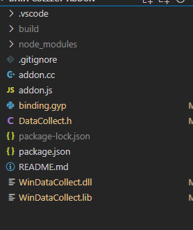

这里我们并不直接使用 node 提供的原生语法，而是用 node-addon-api 这个插件来完成

在此之前先来看下 gyp 相关的语法

新建一个 binding.gyp 文件

```js
{
  "targets": [
    {
     // 导出文件名
      "target_name": "addon",
      // 编译标识的定义 禁用异常机制（注意感叹号表示排除过滤）
      "cflags!": [ "-fno-exceptions" ],
      // c++ 编译标识的定义 禁用异常机制（注意感叹号表示排除过滤，也就是 c++ 编译器会去除该标识）
      "cflags_cc!": [ "-fno-exceptions" ],
      // 源码入口文件 可以引用多个
      "sources": [ "addon.cc", "DataCollect.h"],
      // 源码包含的目录
      "include_dirs": [
          // 这里表示一段 shell 的运行，用来获取 node-addon-api 的一些参数，可以自行 node -p "require('node-addon-api').include" 来看效果
        "<!@(node -p \"require('node-addon-api').include\")"
      ],
      // 环境变量的定义
      'defines': [ 'NAPI_DISABLE_CPP_EXCEPTIONS' ],
      'conditions' : [
        ['OS=="win"',
        {
            // 引用的静态库
          "libraries": [
            '../WinDataCollect64.lib'
          ]
        }]
      ]
    }
  ]
}

```

安装 bindings 和 node-addon-api

bindings 主要时用来测试 打包后的代码
node-addon-api 是对原生语法的封装 使编写更方便

项目结构目录



- build 是打包后的文件夹
- addon.cc 是入口文件
- addon.js 是测试文件
- binding.gyp 是配置文件
- DataCollect.h 是调用库的头文件
- WinDataCollect.lib 是调用库的静态文件
- WinDataCollect.dll 是调用库的动态文件

addon.cc

```c++
#include <napi.h>
#include "DataCollect.h"
#include<iostream>

// 定义一个对象
Napi::Object GetSystemInfo(const Napi::CallbackInfo& info) {
  Napi::Env env = info.Env();
  // 定义一个对象
  Napi::Object obj = Napi::Object::New(env);

  char pSystemInfo[344];  // 定义一个字符串类型的字段
  int len; // 定义一个int类型的字段
    // 这个是 DataCollect.h 提供的方法
  CTP_GetSystemInfo(pSystemInfo, len);
  Napi::String str =  Napi::String::New(env, pSystemInfo);
  Napi::Number num = Napi::Number::New(env, len);
  // 把参数放入一个对象中
  obj.Set(Napi::String::New(env, "pSystemInfo"), str);
  obj.Set(Napi::String::New(env, "len"), num);
  // 返回对象
  return obj;
}

// 入口函数，用于注册我们的函数、对象等等
Napi::Object Init(Napi::Env env, Napi::Object exports) {
    //  将一个名为 CTP_GetSystemInfo 的函数导出
  exports.Set(Napi::String::New(env, "CTP_GetSystemInfo"), Napi::Function::New(env, GetSystemInfo));
  return exports;
}

// 固定的宏使用
NODE_API_MODULE(addon, Init)
```

全局安装 node-gyp

看一下 package.json 的配置命令

```js
  "scripts": {
    "test": "node addon.js",
    "configure": "node-gyp configure",
    "build": "node-gyp build",
    "build:dev": "node-gyp build --debug",
    "rebuild:64": "node-gyp rebuild --target=11.2.0 --arch=x64 --target_platform=win32 --dist-url=https://atom.io/download/atom-shell",
    "rebuild:32": "node-gyp rebuild --target=11.2.0 --arch=ia32 --target_platform=win32 --dist-url=https://atom.io/download/atom-shell"
  },
```

看一下 addon.js 文件

```js
var addon = require("bindings")("addon.node");

console.log("This should be :", addon.CTP_GetSystemInfo());
```

打包会生成一个 addon.node 的文件 然后测试 正常输出内容 即调用成功
