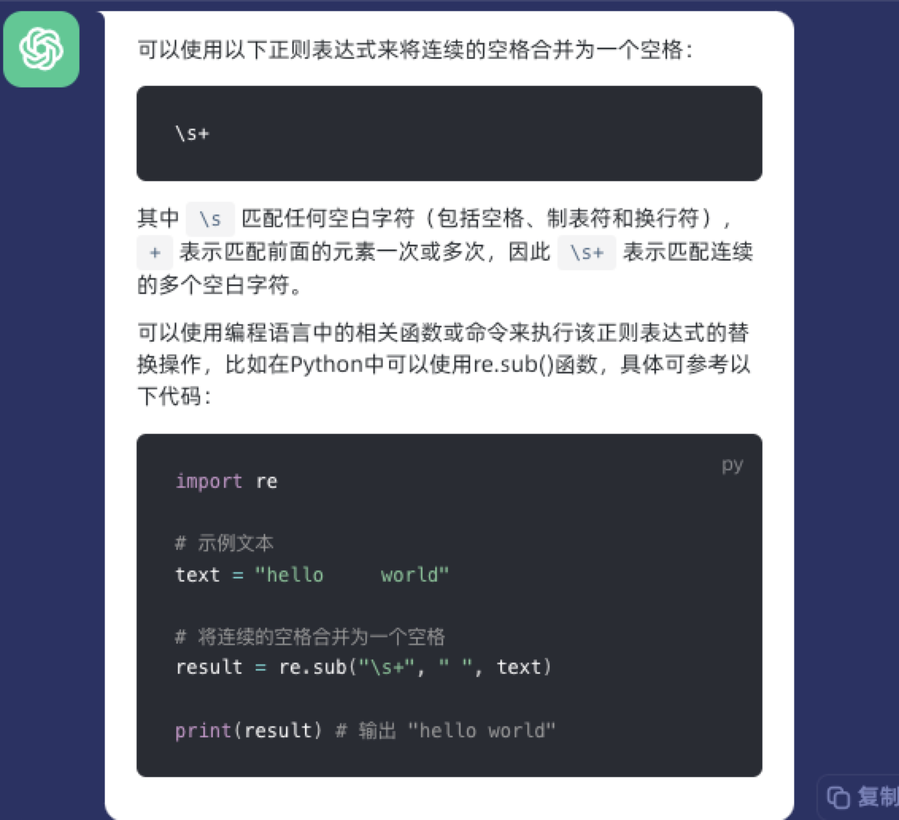
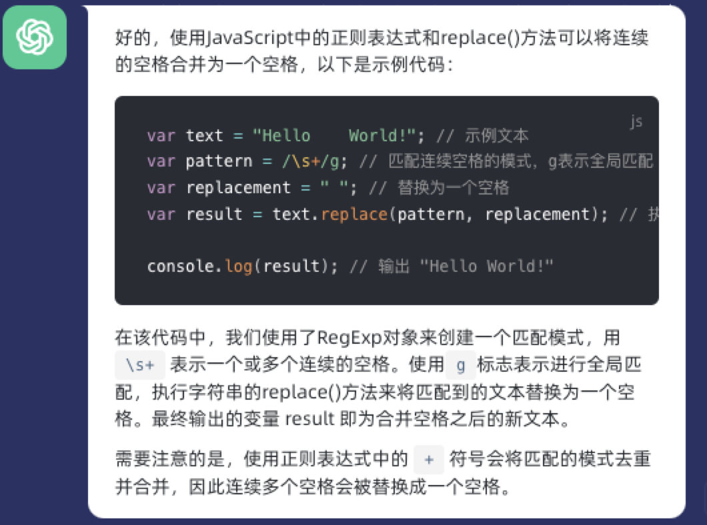

一些思考和使用技巧

主要记录一些使用技巧 怎样搜索可以更精确 来快速完成业务开发 提高开发效率

## chatGpt

目前使用不是很多 并没有深层次理解，先写一点自己的看法和理解 后续再做补充

chatGpt 可以帮助我们更快的开发 比如 我遇到一个问题 需要写一个正则表达式 本身我对正则也不是很熟练
这个时候可以使用 gpt 帮助我写这个正则 那么这样就避免了我们很多搜索和验证的时间

比如 帮我写一个正则 连续的空格 合并成一个空格 生成以下内容

如果你想要对应的 特定的语言 可以描述的更加清晰

用 js 语言帮我写一个正则 连续的空格 合并成一个空格

目前得到一个比较多“浅显”的理论是 对于提出的问题，我们要有自己明确的上下文 基于什么的语言 或者什么样的场景 或者 一些其他必要的条件 搜索出来的内容可能会更加 精确，当然 这个提问 也可以是连续的 ，连续的提问修正结果 达到自己想要的内容

## copilot

copilot 写注释 生成代码，目前还没有什么心的
