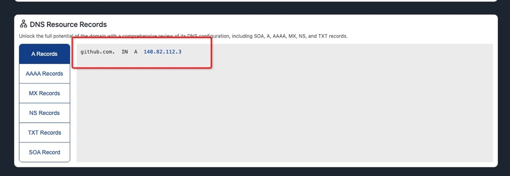
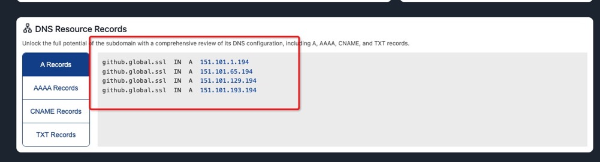

# 访问 github 加速

经常 github 推送超时失败，可以使用以下方法加速访问 github

## 查询域名的 ip 地址

[打开网址](https://sites.ipaddress.com/github.com/)
拉到网址的最下面 然后复制 ip 地址

如图

[打开网址](https://sites.ipaddress.com/github.global.ssl.fastly.net/)
拉到网址的最下面 然后复制 ip 地址

## 配置 host

然后配置 host 如下图

## 刷新 DNS 缓存

执行

`sudo killall -HUP mDNSResponder`

然后重新推送 发现访问快了很多
