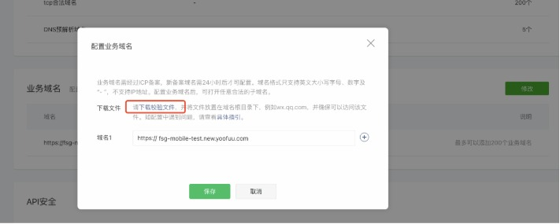

如标题所示一些问题的汇总以及方案

## rich-text

小程序 rich-text 标签渲染富文本标签 有诸多限制 不能像 H5 一样

比如 table 标签 一些合并单元格的属性是不支持的 这个时候想要解决 table 样式问题 就只能把 样式设置到 style 上面

看个例子

```js
content?.replace(/<table[^>]*>/gi, (_) => {
  return `<table border="1" cellpadding="0" cellspacing="0" width="100%" bordercolor="#DFDFDF" style="border-collapse:collapse;"  >`;
});
// border="1" cellpadding="0" cellspacing="0" 这些属性在小程序全部不生效 所以要都设置到 style中
```

[具体的可以查看文档](https://developers.weixin.qq.com/miniprogram/dev/component/rich-text.html)

还遇到了一种写法

```js
const str = `<style>.test{color:red}</style><div class="test">测试</div>`;
```

这种格式也是无法渲染的 rich-text 只能渲染 dom 节点 所以为了渲染一下奇怪的富文本 于是放弃这种写法 采用嵌套 H5 的方式

于是嵌套又产生了一些新的问题

## 小程序 web-view 的问题

小程序 web-view 嵌套 H5 首先 第一点 要在后台设置 webview 业务域名 否则是不允许嵌套的

比如 你要嵌套 baidu.com 首先你要在 baidu.com 服务下放置你要嵌套的小程序的签名



点击下载校验文件 把文件放置到 baidu.com 下 然后再把配置到地址 输入

怎么判断配置成功呢 访问 baidu.com/xxx.txt 有内容 代表配置成功

这个时候就可以嵌套 baidu.com H5 页面

要注意一点 baidu.com 这个页面 里面不能嵌套 iframe 如果嵌套了 那么 这个 iframe 也需要 配置在 业务域名下 否则后报错 不支持访问 当然你也可以删除这个 iframe

嵌套的 webview 导航顶部可能是 黑色的 那么可以配置 `navigationBarBackgroundColor: '#fff',` 变成白色

而且 这个标题好像不可以更改 只能尝试修改 H5 的 title 比如 例如设置 H5 document.title="商品详情"

并且 ios 下 https 域名下的 http 图片无法正常打开 需要把 http 的图片修改为 https 安卓下 没有发现这个问题
