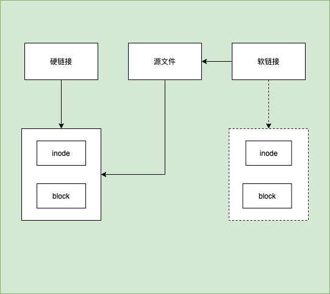
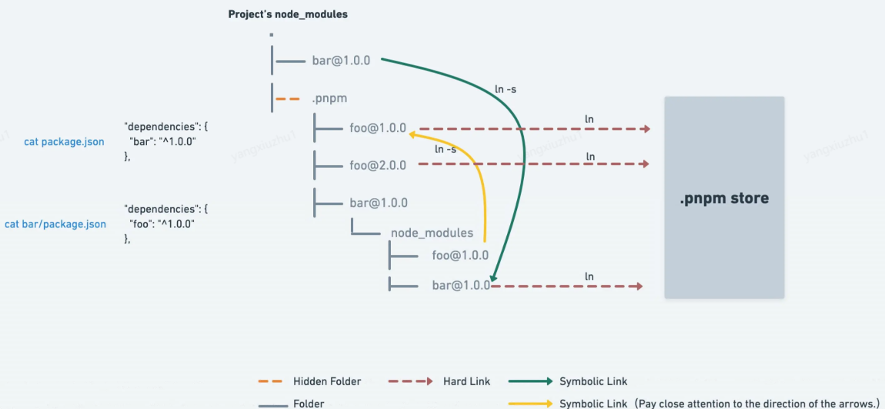

# 认识 pnpm

pnpm - 速度快、节省磁盘空间的软件包管理器

## 软链接 硬链接

在计算机中我们文件夹中的文件实际上是一个指针，但是这个指针并不是直接指向我们在磁盘中存储文件的位置，而是指向一个 inode 块，inode 块中存储着文件在磁盘中的各种信息，一般我们的文件都是指向对应的 inode，这种链接称为硬链接。

还有一种链接，他存储的不是实际的值，而是另一个硬链接的地址，这种链接称为软链接

## pnpm 为什么用软链接和硬链接

1. 解决幽灵依赖
2. 节省磁盘空间

## 如何解决幽灵依赖

当我们使用 npm 或者 yarn 安装依赖时，由于采用的是扁平化的装包策略，这会导致我们安装的包和实际 package.json 中定义的依赖并不一致，
很多我们包只是依赖用到的包也会出现在 node_modules 里，这就导致了 我们也可以直接使用未安装的包，这种情况就是幽灵依赖

当我们使用 pnpm 安装依赖时，我们 node_modules 结构很清晰都是我们 package.json 中定义的依赖，他真正的文件目录是在.pnpm 文件夹中，通过这种软链接的方式就可以解决幽灵依赖的问题，同时也兼容了 node 寻找 node 寻找模块的方式

所以说 pnpm 的软链接就是将 node_modules 里的文件软链接到对应的 `.pnpm/[package_name]@version/node_modules/[package_name]` 中。

## 如何节省磁盘空间

1. 如果你用到了某依赖项的不同版本，只会将不同版本间有差异的文件添加到仓库（store）。

例如，如果某个包有 100 个文件，而它的新版本只改变了其中 1 个文件。那么 pnpm update 时只会向存储中心额外添加 1 个新文件，而不会因为仅仅一个文件的改变复制整新版本包的内容。

2. 所有文件都会存储在硬盘上的某一位置。

当软件包被被安装时，包里的文件会硬链接到这一位置，而不会占用额外的磁盘空间这允许你跨项目地共享同一版本的依赖。

pnpm 有个根目录，一般都是保存在 user/.pnpm-store 下，pnpm 通过硬链接的方式保证了相同的包不会被重复下载，比如说我们已经在 repoA 中下载过一次 express@4.17.1 版本，那我们后续在 repoB 中安装 express@4.17.1 的时候是会被复用的，具体就是 repoA 中的 express 中的文件和 repoB 中的 express 中的文件指向的是同一个 inode。

## 总结

pnpm 通过软、硬链接（hark link、symbolic link） + 全局存储（store）结合的依赖管理方式完全实现了依赖树结构的包管理方式，解决了 npm3 及 yarn 中的幽灵依赖和 npm 分身的问题，提升了依赖包的安装速度，减小了磁盘空间占用。

