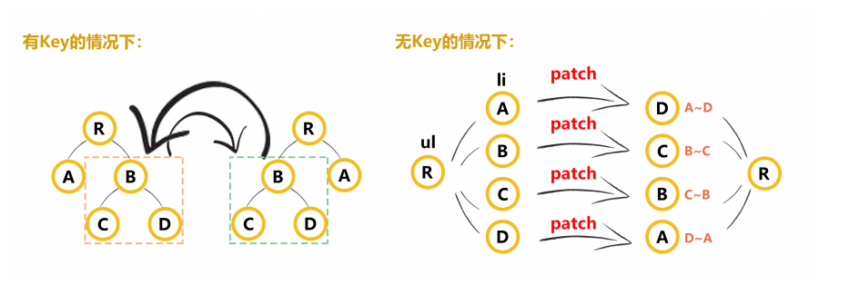

key 的作用是更新组件的时候判断两个节点是否相同，如果相同就复用，不相同就删除旧的创建新的

官网推荐推荐的使用 key，应该理解为“使用唯一 id 作为 key”。因为 index 作为 key，和不带 key 的效果是一样的。index 作为 key 时，每个列表项的 index 在变更前后也是一样的，都是直接判断为 sameVnode 然后复用。

因为不带 key 时节点能够复用，（两者的 key 都是 undefined 所以判断是相同的）省去了销毁/创建组件的开销，同时只需要修改 DOM 文本内容而不是移除/添加节点，这就是文档中所说的“刻意依赖默认行为以获取性能上的提升”。

既然不带 key 可以节省性能 ，为什么还要建议带 key 呢，

因为不带 key 只适合渲染简单无状态的组件，而大多数场景，列表组件都是有状态的

例如遍历一个 多选框

勾选第二个选项 然后删除第二个选项 ，之后会发现 勾选的状态依然存在，这就是因为组件被复用了，所以状态依然存在，

如果我们加上一个唯一的 id 那么就可以解决这个问题

