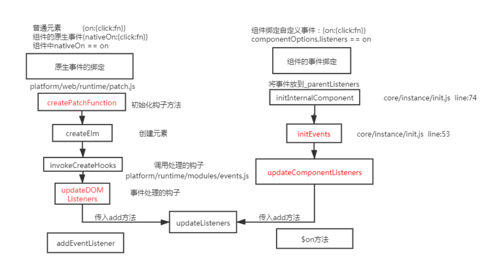

<!-- vue 中事件绑定分为原生事件绑定和组件事件绑定

- 原生事件绑定 采用的是 addEventListener 实现的
- 组件事件绑定是采用$on 方法

## 事件编译

```js
let compiler = require("vue-template-compiler");
let r1 = compiler.compile('<div @click="fn()"></div>');
let r2 = compiler.compile(
  '<my-component @click.native="fn" @click="fn1"></mycomponent>'
);
console.log(r1); // {on:{click}}
console.log(r2); // {nativeOnOn:{click},on:{click}}
```

## 流程图



## 原生 dom 的绑定

- vue 会再创建真实 dom 是调用 createElm,默认会调用 invokeCreateHooks
- 会遍历当前平台下相对的属性代码处理，其中就有 updateDoMListeners 内部会传入 add 方法

```js
function updateDOMListeners(oldVnode: VNodeWithData, vnode: VNodeWithData) {
  if (isUndef(oldVnode.data.on) && isUndef(vnode.data.on)) {
    return;
  }
  const on = vnode.data.on || {};
  const oldOn = oldVnode.data.on || {};
  target = vnode.elm;
  normalizeEvents(on);
  updateListeners(on, oldOn, add, remove, createOnceHandler, vnode.context);
  target = undefined;
}
function add(
  name: string,
  handler: Function,
  capture: boolean,
  passive: boolean
) {
  target.addEventListener(
    // 给当前的dom添加事件
    name,
    handler,
    supportsPassive ? { capture, passive } : capture
  );
}
```

## 组件绑定事件

组件绑定事件是通过$on 实现的

```js
export function updateComponentListeners(
  vm: Component,
  listeners: Object,
  oldListeners: ?Object
) {
  target = vm;
  updateListeners(
    listeners,
    oldListeners || {},
    add,
    remove,
    createOnceHandler,
    vm
  );
  target = undefined;
}
function add(event, fn) {
  target.$on(event, fn);
}
``` -->

内容有待调整
