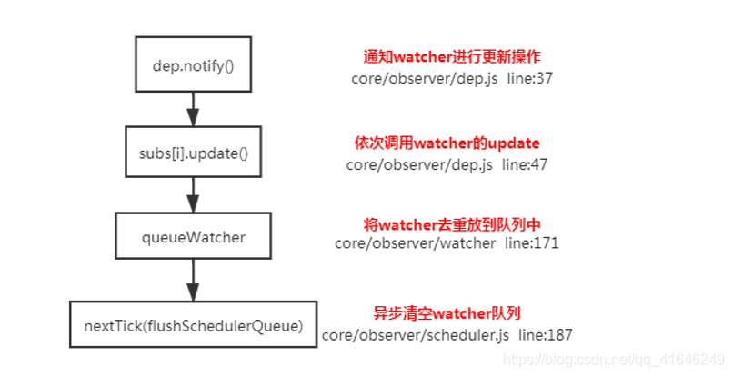

如果每次更新数据都立刻重新渲染的话，那么时很耗费性能的，Vue 会在本轮数据更新结束之后，再异步更新视图，就会节省很多性能



```js
    update () {    /* istanbul ignore else */    
        if (this.lazy) {      
            this.dirty = true  
            } else if (this.sync) {      
                this.run()  
            } else {    
                queueWatcher(this); // 当数据发生变化时会将watcher放到一个队列中批量更新  
            }
    }
    export function queueWatcher (watcher: Watcher) {  
            const id = watcher.id // 会对相同的watcher进行过滤  
            if (has[id] == null) {    
                has[id] = true    
                if (!flushing) {      
                    queue.push(watcher)  
                    } else {      
                        let i = queue.length - 1      
                        while (i > index && queue[i].id > watcher.id) {        
                            i--   
                        }      
                        queue.splice(i + 1, 0, watcher)  
                        }    
                        // queue the flush    
                        if (!waiting) {    
                             waiting = true
                             if (process.env.NODE_ENV !== 'production' && !config.async) {        
                                flushSchedulerQueue()        
                                return    
                                }      
                                nextTick(flushSchedulerQueue) // 调用nextTick方法 批量的进行更新  
                        }
                }
    }
```
