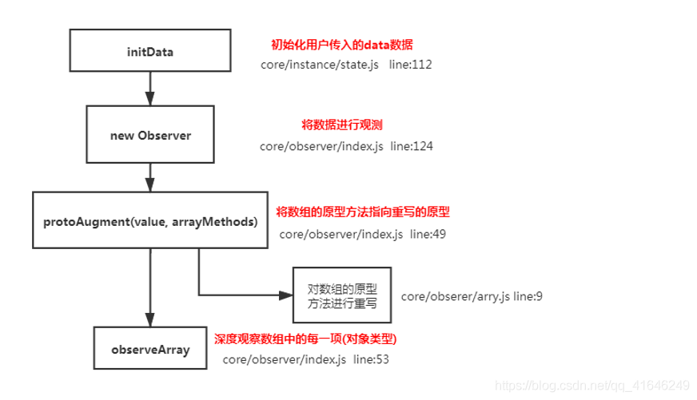

vue 是使用函数劫持 的方式重写了数组方法，对 data 中的数组进行了原型链的重写，指向了自己定义的数组原型方法，
这样当调用数组 api 时，可以通知依赖更新，如果数组中有引用类型，会对数组中引用类型再次监控

流程图


```js
const arrayProto = Array.prototype;
export const arrayMethods = Object.create(arrayProto);
const methodsToPatch = [
  "push",
  "pop",
  "shift",
  "unshift",
  "splice",
  "sort",
  "reverse",
];
methodsToPatch.forEach(function (method) {
  // 重写原型方法  const original = arrayProto[method]
  // 调用原数组的方法
  def(arrayMethods, method, function mutator(...args) {
    const result = original.apply(this, args);
    const ob = this.__ob__;
    let inserted;
    switch (method) {
      case "push":
      case "unshift":
        inserted = args;
        break;
      case "splice":
        inserted = args.slice(2);
        break;
    }
    if (inserted) ob.observeArray(inserted); // notify change
    ob.dep.notify(); // 当调用数组方法后，手动通知视图更新
    return result;
  });
});
this.observeArray(value); // 进行深度监控
```
