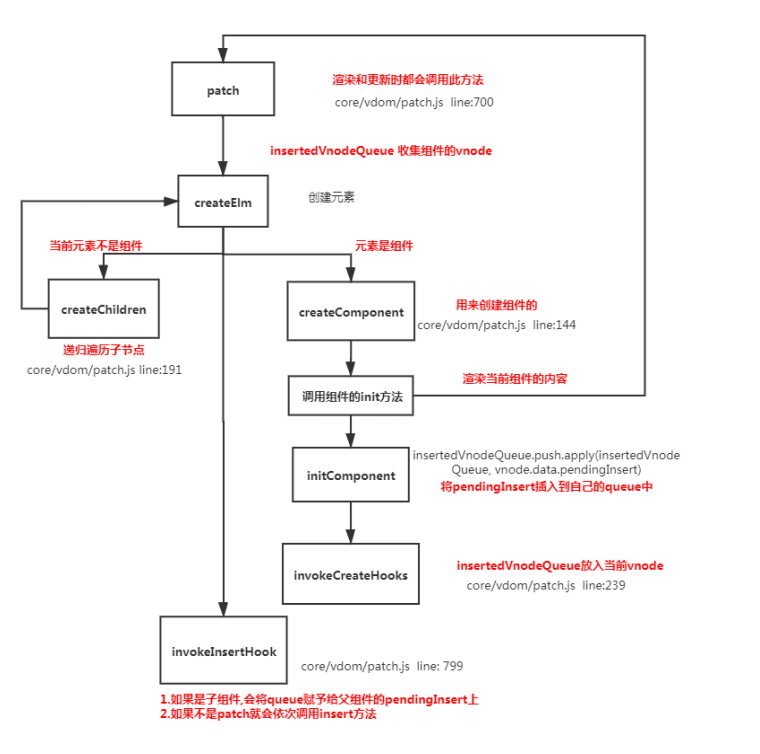

## 加载渲染过程

父 beforeCreate->父 created->父 beforeMount->子 beforeCreate->子 created->子 beforeMount-> 子 mounted->父 mounted

因为父组件执行完 beforeMount 之后 开始调用 render 函数，当渲染的时候发现子组件，直接执行子组件的渲染过程，子组件渲染完成 才接着渲染父组件

## 子组件更新过程

父 beforeUpdate->子 beforeUpdate->子 updated->父 updated

## 父组件更新过程

父 beforeUpdate->父 updated

## 销毁过程

父 beforeDestroy->子 beforeDestroy->子 destroyed->父 destroyed

## 理解

组件的调用顺序都是先父后子，渲染完成的顺序 是先子后父

组件的销毁时先父后子 销毁完成的顺序是先子后父

## 大致流程图

