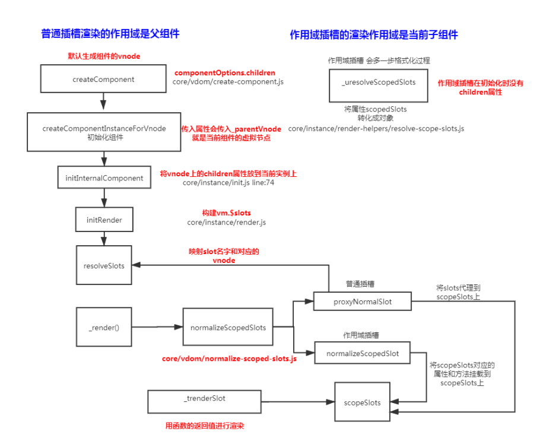

## 普通插槽

普通插槽是在父组件编译和渲染阶段生成 vnodes，所以数据的作用域是父组件实例，子组件渲染的时候直接拿到这些渲染好的 vnodes

```js
const VueTemplateCompiler = require("vue-template-compiler");
let ele = VueTemplateCompiler.compile(`
<my-component>
<div slot="header">node</div>
<div>react</div>
<div slot="footer">vue</div>
</my-component>
`);
/**
with (this) {
  return _c("my-component", [
    _c(
      "div",
      {
        attrs: {
          slot: "header",
        },
        slot: "header",
      },
      [_v("node")] // _文本及诶点
    ),
    _v(" "),
    _c("div", [_v("react")]),
    _v(" "),
    _c(
      "div",
      {
        attrs: {
          slot: "footer",
        },
        slot: "footer",
      },
      [_v("vue")]
    ),
  ]);
}
*/
const VueTemplateCompiler = require("vue-template-compiler");
let ele = VueTemplateCompiler.compile(`
<div>
<slot name="header"></slot>
<slot name="footer"></slot>
<slot></slot>
</div>
`);
/**
with(this) {
    return _c('div', [_v("node"), _v(" "), _t(_v("vue")])]), _v(" "),
    _t("default")], 2)
}
/*
// _t定义在 core/instance/render-helpers/index.js

```

## 作用域插槽

父组件在编译和渲染阶段并不会直接生成 vnodes，而是在父节点 vnode 的 data 中保留一个 scopedSlots 对象，存储着不同名称的插槽以及它们对应的渲染函数，只有在编译和渲染子组件阶段才会执行这个渲染函数生成 vnodes，由于是在子组件环境执行的，所以对应的数据作用域是子组件实例。

```js
let ele = VueTemplateCompiler.compile(`
<app>
<div slot-scope="msg" slot="footer">{{msg.a}}</div>
</app>
`);
/**
with(this) {
    return _c('app', {
        scopedSlots: _u([{ // 作用域插槽的内容会被渲染成一个函数
            key: "footer",
            fn: function (msg) {
            return _c('div', {}, [_v(_s(msg.a))])
            }
        }])
    })
   }
}
*/
const VueTemplateCompiler = require("vue-template-compiler");
VueTemplateCompiler.compile(`
<div>
<slot name="footer" a="1" b="2"></slot>
</div>
`);
/**
    with(this) {
        return _c('div', [_t("footer", null, {
            "a": "1",
            "b": "2"
    })], 2)
}
**/
```

## 流程图


