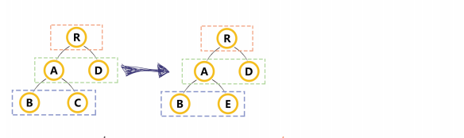
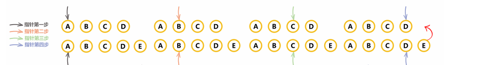
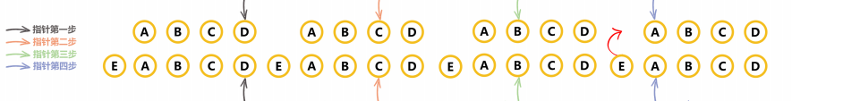
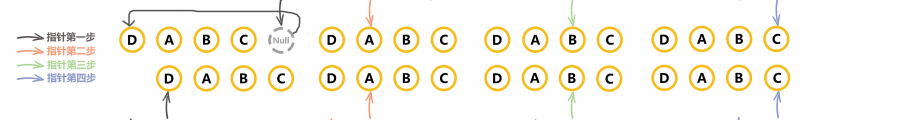
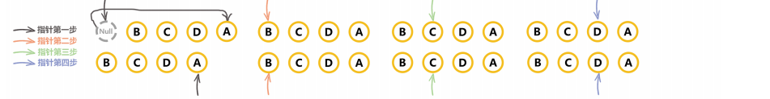
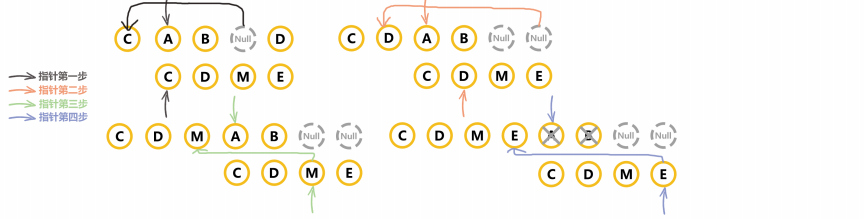

## 虚拟 dom

虚拟 dom 只是以对象的形式模拟树形结构

```js
// 真实dom结构
<div>
  <div>name</div>
</div>;

// 虚拟dom结构
let vNode = {
  tag: "div",
  children: {
    tag: "div",
    text: "name",
  },
};
```

因为使用了虚拟 dom 所以就牵扯出了 diff 算法

虚拟 dom 真的快吗？其实虚拟 dom 主要是为了 实现数据驱动试图，简化了一些操作和逻辑，比起直接获取 dom 然后更新，虚拟 dom 没有很快，因为更新 首先要 data 发生变化 经过 diff 算法 再更新 dom 可见这一系列的过程 其实是比真实操作 dom 要慢的

- vdom 并不快 js 直接操作才更快
- 数据驱动视图要有合适的方案，不能全部 DOM 重建
- vdom 是目前最合适的方案 并不是因为快 而是因为合适

## diff 算法的比较方式

vue 的 diff 算法过程实际上就是调用 patch 函数，比较新旧节点，一边比较一边给修改真实 dom(同级比较,不会跨级比较)


## patch

patch 会接收两个参数 oldVnode（旧节点） 和 Vnode（新节点） 新旧节点

```js
function patch(oldVnode, vnode) {
  // some code
  if (sameVnode(oldVnode, vnode)) {
    patchVnode(oldVnode, vnode);
  } else {
    const oEl = oldVnode.el; // 当前oldVnode对应的真实元素节点
    let parentEle = api.parentNode(oEl); // 父元素
    createEle(vnode); // 根据Vnode生成新元素
    if (parentEle !== null) {
      api.insertBefore(parentEle, vnode.el, api.nextSibling(oEl)); // 将新元素添加进父元素
      api.removeChild(parentEle, oldVnode.el); // 移除以前的旧元素节点
      oldVnode = null;
    }
  }
  // some code
  return vnode;
}
```

判断是否需要进行比较，如果不需要直接新节点替换老节点，如果一样那么再深入查找

看下 sameVnode 函数的判断

```js
function sameVnode(a, b) {
  return (
    a.key === b.key && // key值
    a.tag === b.tag && // 标签名
    a.isComment === b.isComment && // 是否为注释节点
    // 是否都定义了data，data包含一些具体信息，例如onclick , style
    isDef(a.data) === isDef(b.data) &&
    sameInputType(a, b) // 当标签是<input>的时候，type必须相同
  );
}
```

我们发现只有 key 和 tag 标签一致才会进行比较，所以 key 的重要性就提现出来了

再来看看比较之后 patchVnode 做了什么事情

```js
patchVnode (oldVnode, vnode) {
    const el = vnode.el = oldVnode.el
    let i, oldCh = oldVnode.children, ch = vnode.children
    if (oldVnode === vnode) return
    if (oldVnode.text !== null && vnode.text !== null && oldVnode.text !== vnode.text) {
        api.setTextContent(el, vnode.text)
    }else {
        updateEle(el, vnode, oldVnode)
    	if (oldCh && ch && oldCh !== ch) {
	    	updateChildren(el, oldCh, ch)
	    }else if (ch){
	    	createEle(vnode) //create el's children dom
	    }else if (oldCh){
	    	api.removeChildren(el)
	    }
    }
}
```

- 找到对应的真实 dom
- 判断新旧节点是否指向同一对象
- 判断文本内容 如果有并且不相等，那么更新 vnode 的内容
- 如果老节点有子节点，而新节点没有，那么直接删除
- 如果老节点没有，新节点有，那么将虚拟 dom 转化成真实 dom 添加上去
- 如果都有子节点，那么直接更新 函数比较子节点

## 比较重要的 updateChildren

- 先同级比较 在比较子节点
- 先判断一方有儿子一方没有儿子的情况
- 比较都有儿子的情况
- 递归比较子节点




双指针从头开始比较，如果开始节点 tag 和 key 相同，那么双指针向后移动，一直到最后一个节点，发现 E，直接把 E 节点移动到旧的虚拟 DOM 上



如果开始头节点不相同，那么双指针会移动到后面，开始比较，一直比较发现不同的节点，移动 E 节点



如果首尾节点比较都不相同，就是不属于以上两种情况，那么就会脚叉比交，收节点和尾节点比较，如果相同，那么会把末尾节点移动到开始节点，然后再循环比较，可以看图理解



这一种刚好是和上一个相反的情况



最后一种也是最复杂的一种，交叉比较 然后相同节点移动，最后比较完毕 保留相同节点，删除无用节点

<!-- 


 -->

```js
function updateChildren(
  parentElm,
  oldCh,
  newCh,
  insertedVnodeQueue,
  removeOnly
) {
  let oldStartIdx = 0;
  let newStartIdx = 0;
  let oldEndIdx = oldCh.length - 1;
  let oldStartVnode = oldCh[0];
  let oldEndVnode = oldCh[oldEndIdx];
  let newEndIdx = newCh.length - 1;
  let newStartVnode = newCh[0];
  let newEndVnode = newCh[newEndIdx];
  let oldKeyToIdx, idxInOld, elmToMove, refElm;

  // removeOnly is a special flag used only by <transition-group>
  // to ensure removed elements stay in correct relative positions
  // during leaving transitions
  const canMove = !removeOnly;

  while (oldStartIdx <= oldEndIdx && newStartIdx <= newEndIdx) {
    if (isUndef(oldStartVnode)) {
      oldStartVnode = oldCh[++oldStartIdx]; // Vnode has been moved left
    } else if (isUndef(oldEndVnode)) {
      oldEndVnode = oldCh[--oldEndIdx];
    } else if (sameVnode(oldStartVnode, newStartVnode)) {
      patchVnode(oldStartVnode, newStartVnode, insertedVnodeQueue);
      oldStartVnode = oldCh[++oldStartIdx];
      newStartVnode = newCh[++newStartIdx];
    } else if (sameVnode(oldEndVnode, newEndVnode)) {
      patchVnode(oldEndVnode, newEndVnode, insertedVnodeQueue);
      oldEndVnode = oldCh[--oldEndIdx];
      newEndVnode = newCh[--newEndIdx];
    } else if (sameVnode(oldStartVnode, newEndVnode)) {
      // Vnode moved right
      patchVnode(oldStartVnode, newEndVnode, insertedVnodeQueue);
      canMove &&
        nodeOps.insertBefore(
          parentElm,
          oldStartVnode.elm,
          nodeOps.nextSibling(oldEndVnode.elm)
        );
      oldStartVnode = oldCh[++oldStartIdx];
      newEndVnode = newCh[--newEndIdx];
    } else if (sameVnode(oldEndVnode, newStartVnode)) {
      // Vnode moved left
      patchVnode(oldEndVnode, newStartVnode, insertedVnodeQueue);
      canMove &&
        nodeOps.insertBefore(parentElm, oldEndVnode.elm, oldStartVnode.elm);
      oldEndVnode = oldCh[--oldEndIdx];
      newStartVnode = newCh[++newStartIdx];
    } else {
      if (isUndef(oldKeyToIdx))
        oldKeyToIdx = createKeyToOldIdx(oldCh, oldStartIdx, oldEndIdx);
      idxInOld = isDef(newStartVnode.key)
        ? oldKeyToIdx[newStartVnode.key]
        : null;
      if (isUndef(idxInOld)) {
        // New element
        createElm(
          newStartVnode,
          insertedVnodeQueue,
          parentElm,
          oldStartVnode.elm
        );
        newStartVnode = newCh[++newStartIdx];
      } else {
        elmToMove = oldCh[idxInOld];
        if (sameVnode(elmToMove, newStartVnode)) {
          patchVnode(elmToMove, newStartVnode, insertedVnodeQueue);
          oldCh[idxInOld] = undefined;
          canMove &&
            nodeOps.insertBefore(
              parentElm,
              newStartVnode.elm,
              oldStartVnode.elm
            );
          newStartVnode = newCh[++newStartIdx];
        } else {
          // same key but different element. treat as new element
          createElm(
            newStartVnode,
            insertedVnodeQueue,
            parentElm,
            oldStartVnode.elm
          );
          newStartVnode = newCh[++newStartIdx];
        }
      }
    }
  }
  if (oldStartIdx > oldEndIdx) {
    refElm = isUndef(newCh[newEndIdx + 1]) ? null : newCh[newEndIdx + 1].elm;
    addVnodes(
      parentElm,
      refElm,
      newCh,
      newStartIdx,
      newEndIdx,
      insertedVnodeQueue
    );
  } else if (newStartIdx > newEndIdx) {
    removeVnodes(parentElm, oldCh, oldStartIdx, oldEndIdx);
  }
}
```

diff 算法采用的是双指针的算法

参考文章：

- https://juejin.cn/post/6844903897262194696
- https://juejin.cn/post/6844903607913938951#heading-0
- https://github.com/aooy/blog/issues/2
