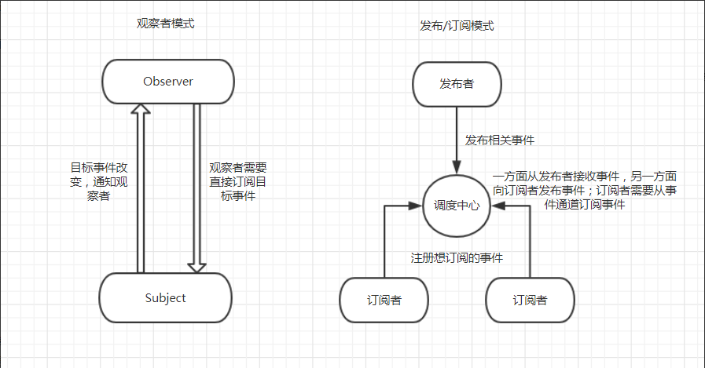
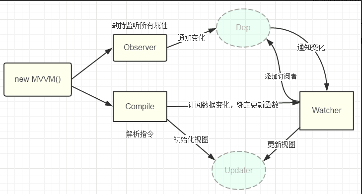

## 发布订阅模式

vue 响应式原理用到了发布订阅模式，所以我们先来理解一下发布订阅模式，

发布订阅模式比观察者模式多了一个调度中心，发布者不直接和订阅者通信，而是通过调度中心分发消息

## vue 响应式原理

vue 响应式原理核心思想 发布订阅模式 + Object.defineProperty

- 首先 vue 初始化（initData）会对 props、methods、data、computed 和 wathcer 等属性做了初始化操作。(源码位置：src/core/instance/state.js)
- 数据劫持（Observe）data 中的所有属性都变成响应式的（源码位置：src/core/observer/index.js）
  - 遍历所有属性调用内部封装 Object.defineProperty 的 defineReactive 方法
  - Object.defineProperty 内部会在 get 中进行依赖收集 set 中通知更新
- Dep 调度中心（源码位置：src/core/observer/dep.js）
  - dep 会在数据劫持的时候实例化
  - 主要式收集订阅者并添加到列表中（在 get 中收集）
  - 接收发布者的事件，通知订阅者目标更新，让订阅者执行自己的更新方法（在 set 中通知更新）
- watcher 订阅者（源码位置：src/core/observer/watcher.js）
  - template 中使用的数据就是订阅者，他会在模板解析的时候订阅方法
  - 当调度中心（dep）通知订阅者（watcher）那么就会触发自身的更新方法，然后更新视图

只是一些文字简单版本的理解,想要更深入的了解，可以看源码或者[vue.js 揭秘](https://ustbhuangyi.github.io/vue-analysis/v2/reactive/)
