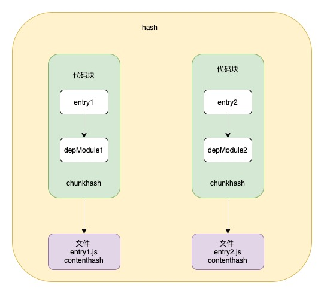

## hash chunkhash contenthash

- 文件指纹是指打包后输出的文件名和后缀
- hash 一般是结合 CDN 缓存来使用，通过 webpack 构建之后，生成对应文件名自动带上对应的 MD5 值，如果文件内容改变 那么对应的文件 hash 值也会改变
  ，对应的 HTML 引用的 URL 地址也会改变，触发 CDN 服务器从源服务器获取对应的数据，更新缓存

指纹占位符号

| 占位符名称  | 含义                                                         |
| ----------- | ------------------------------------------------------------ |
| ext         | 资源后缀名                                                   |
| name        | 文件名称                                                     |
| path        | 文件的相对路径                                               |
| folder      | 文件所在的文件夹                                             |
| hash        | 每次 webpack 构建生成的一个唯一的 hash 值                    |
| chunkhash   | 根据 chunk 生成 hash 值，来源于同一个 chunk，hash 值是一样的 |
| contenthash | 根据内容生成 hash 值，文件内容相同 hash 值相同               |



## hash

hash 是整个项目的 hash 值，其根据每次编译内容计算得到，每次编译之后都会生成新的 hash,即修改任何文件都会导致所有文件都 hash 发生改变

```js
module.exports = {
  entry: {
    main: "./src/index.js",
  },
  output: {
    path: path.resolve(__dirname, "dist"),
    filename: "[name].[hash].js",
  },
};
```

## chunkhash

- chunkhash 如果如果采用 hash 计算的话，每次构建后生成 hash 值都不一样，即使文件内容没有改变，这样子是美没有办法实现缓存，所以要换另一种 hash 计算方式

- chunkhash 和 hash 不一样，它根据不同的入口文件进行依赖解析，构建对应的 chunk，生成对应的哈希值，我们在生产环境里把一些公共库和程序入口文件区分开，单独打包构建，然后采用 chunkhash 的方式生成哈希值，只要公共代码库没有改动，那么这个哈希值就不会改变

```js
module.exports = {
  entry: {
    main: "./src/index.js",
    vender: ["lodash"],
  },
  output: {
    path: path.resolve(__dirname, "dist"),
    filename: "[name].[chunkhash].js",
  },
  plugins:[
    new MiniCssExtractPlugin({
      filename: 'css/[name].[chunkhash].css'
      ignoreOrder: true,
    }),
  ]
};
```

## contenthash

使用 chunkhash 会存在一个问题，当一个 js 文件中引入 css，编译后他们的哈希值是相同的，而且只要 js 文件发生改变，关联的 css 文件 hash 值也会发生改变，这个时候可以使用 contenthash ，contenthash 可以保证 css 文件所处的模块里其他文件改变，只要 css 文件不改变，那么哈希值就不会改变

```js
module.exports = {
  entry: {
    main: "./src/index.js",
    vender: ["lodash"],
  },
  output: {
    path: path.resolve(__dirname, "dist"),
    filename: "[name].[chunkhash].js",
  },
  plugins:[
    new MiniCssExtractPlugin({
      filename: 'css/[name].[contenthash].css'
      ignoreOrder: true,
    }),
  ]
};
```
