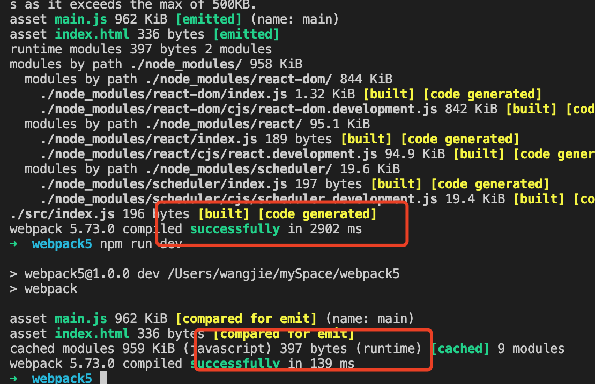

## webpack5 新特性

- 启动命令
- 持久化缓存
- 资源模块
- moduleIds 和 chunkIds 的优化
- 更智能的 tree shaking
- nodejs 的 polyfill 脚本被移除
- 模块联邦

## 启动命令

安装

```
npm i webpack webpack-cli webpack-dev-server html-webpack-plugin babel-loader @babel/core @babel/preset-env @babel/preset-react style-loader css-loader --save-dev

npm  i react react-dom --save
```

新建文件 webpack.config.js

```js
const HtmlWebpackPlugin = require("html-webpack-plugin");
const path = require("path");

module.exports = {
  mode: "development",
  devtool: false,
  entry: "./src/index.js",
  devServer: {
    port: 8080,
  },
  cache: {},
  module: {
    rules: [
      {
        test: /\.js$/,
        use: [
          {
            loader: "babel-loader",
            options: {
              presets: ["@babel/preset-env", "@babel/preset-react"],
            },
          },
        ],
      },
    ],
  },
  plugins: [
    new HtmlWebpackPlugin({
      template: "./public/index.html",
    }),
  ],
};
```

修改 package.json 命令

```js
  "scripts": {
    "dev": "webpack",
    "start": "webpack serve"
  },
```

之前是 webpack-dev-server 现在 webpack serve 即可 但是依然 依赖的 webpack-dev-server 这个插件 只是命令改变了 所以这个包还是需要安装的

## 持久化缓存

- webpack 会缓存生成 webpack 模块和 chunk 来改善构建速度
- 缓存在 webpack5 默认开启，缓存默认是在内存里 但可以对 cache 进行设置
- webpack 跟踪了每个模块的依赖 并创建了文件系统快照，此快照会与真实的文件系统进行比较 当检测到差异时，将触发对应的模块重新构建

```js
const HtmlWebpackPlugin = require("html-webpack-plugin");
const path = require("path");

module.exports = {
  mode: "development",
  devtool: false,
  entry: "./src/index.js",
  devServer: {
    port: 8080,
  },
  cache: {
    type: "filesystem", // filesystem 或者 memory
    cacheDirectory: path.resolve(__dirname, "node_modules/.cache/webpack"), // 这个配置不写也可以 默认是这个路径
  },
  module: {
    rules: [
      {
        test: /\.js$/,
        use: [
          {
            loader: "babel-loader",
            options: {
              presets: ["@babel/preset-env", "@babel/preset-react"],
            },
          },
        ],
      },
    ],
  },
  plugins: [
    new HtmlWebpackPlugin({
      template: "./public/index.html",
    }),
  ],
};
```

开启缓存 之后两次打包时间明显不同


如果开启了 这个 webpack5 的新属性 那么不要用 cnpm 安装依赖包 会有问题 因为 cnpm 安装把包名更改了 导致 webpack5 出的问题

## 资源模块

- 资源模块是一种模块类型 它允许使用资源文件（字体 图标） 无需配置额外的 loader
- raw-loader => asset/source 导出资源的源代码
- file-loader => asset/resource 发送一个单独的文件并导出 url
- url-loader => asset/inline 导出一个资源的 data url
- asset 在导出一个 data url 和发送一个单独的文件之间选择 之前通过使用 url-loader 并且配置资源体积限制实现
- Rule.type
- asset-modules

```js
const HtmlWebpackPlugin = require("html-webpack-plugin");
const path = require("path");

module.exports = {
  mode: "development",
  devtool: false,
  entry: "./src/index.js",
  devServer: {
    port: 8080,
  },
  cache: {
    type: "filesystem", // filesystem 或者 memory
    cacheDirectory: path.resolve(__dirname, "node_modules/.cache/webpack"), // 这个配置不写也可以 默认是这个路径
  },
  module: {
    rules: [
      {
        test: /\.js$/,
        exclude: /node_modules/,
        use: [
          {
            loader: "babel-loader",
            options: {
              presets: ["@babel/preset-env", "@babel/preset-react"],
            },
          },
        ],
      },
      {
        test: /\.png$/,
        type: "asset/resource", // file-loader
      },
      {
        test: /\.ico$/,
        type: "asset/inline", // url-loader
      },
      {
        test: /\.txt$/,
        type: "asset/source", // raw-loader
      },
      {
        test: /\.jpg$/,
        type: "asset", // raw-loader
        parser: {
          dataUrlCondition: {
            maxSize: 4 * 1024, // 小于4k打包成base64
          },
        },
      },
    ],
  },
  plugins: [
    new HtmlWebpackPlugin({
      template: "./public/index.html",
    }),
  ],
};
```

## moduleIds 和 chunkIds

- module 每一个文件其实可以看成一个 module
- chunk webpack 打包最终生成的代码块 代码块会生成文件，一个文件对应一个 chunk
- 在 webpack5 之前 没有从 entry 打包的 chunk 文件，都会以 1 2 3 的文件命名方式输出 删除某些引入 可能会导致缓存失效
- 在生产模式下，默认启用这些功能 chunkIds:'deterministic',moduleIds:'deterministic',此算法采用确定性的方式将短数字 id（三个或者四个字符）短的 hash 值分配给 modules 和 chunks
- chunkId 设置为 deterministic 则 output 中 chunkFilename 里的[name]会被替换成确定性的短数字 id
- 虽然 chunkId 不变 但是更改 chunk 内容 chunkHash 还是会改变

可选值

- natural 按照使用的顺序的数字 id 1 2 3
- named 方便调试的高可读性 id name.js
- deterministic 根据模块生成的简短 hash 值 233
- size 根据模块大小生成的数字 id

```js
const HtmlWebpackPlugin = require("html-webpack-plugin");
const path = require("path");

module.exports = {
  mode: "development",
  devtool: false,
  entry: "./src/index.js",
  devServer: {
    port: 8080,
  },
  cache: {
    type: "filesystem", // filesystem 或者 memory
    cacheDirectory: path.resolve(__dirname, "node_modules/.cache/webpack"), // 这个配置不写也可以 默认是这个路径
  },
  optimization: {
    moduleIds: "deterministic", // 模块名称的生成规则
    chunkIds: "deterministic", // 代码块名称的生成规则
  },
  output: {
    filename: "[name].js", // 入口代码文件名的生成规则
    chunkFilename: "[name].js", //非入口模块的生成规则
  },
  module: {
    rules: [
      {
        test: /\.js$/,
        exclude: /node_modules/,
        use: [
          {
            loader: "babel-loader",
            options: {
              presets: ["@babel/preset-env", "@babel/preset-react"],
            },
          },
        ],
      },
      {
        test: /\.png$/,
        type: "asset/resource", // file-loader
      },
      {
        test: /\.ico$/,
        type: "asset/inline", // url-loader
      },
      {
        test: /\.txt$/,
        type: "asset/source", // raw-loader
      },
      {
        test: /\.jpg$/,
        type: "asset", // raw-loader
        parser: {
          dataUrlCondition: {
            maxSize: 4 * 1024, // 小于4k打包成base64
          },
        },
      },
    ],
  },
  plugins: [
    new HtmlWebpackPlugin({
      template: "./public/index.html",
    }),
  ],
};
```

## 移除 nodejs 的 polyfill

- webpack4 带了许多 nodejs 核心模块的 polyfill 一旦模块中使用了任何核心模块（如 crypto） 这些模块会被自动启用
- webpack5 不再自动引入这些 polyfill

```js
npm i crypto-js crypto-browserify stream-browserify buffer -D
```

在 index.js 文件中

```js
import CryptoJs from "crypto-js";
console.log(CryptoJs.MD5("ceshi").toString());
```

webpack5 直接打包然后会报错 如果需要 polyfill 如下配置即可

```js
const HtmlWebpackPlugin = require("html-webpack-plugin");
const path = require("path");

module.exports = {
  mode: "development",
  devtool: false,
  entry: "./src/index.js",
  devServer: {
    port: 8080,
  },
  cache: {
    type: "filesystem", // filesystem 或者 memory
    cacheDirectory: path.resolve(__dirname, "node_modules/.cache/webpack"), // 这个配置不写也可以 默认是这个路径
  },
  optimization: {
    moduleIds: "deterministic", // 模块名称的生成规则
    chunkIds: "deterministic", // 代码块名称的生成规则
  },
  output: {
    filename: "[name].js", // 入口代码文件名的生成规则
    chunkFilename: "[name].js", //非入口模块的生成规则
  },
  resolve: {
    // 如果不需要 则直接改为false
    // fallback: {
    //   crypto: false,
    //   stream: false,
    //   buffer: false,
    // },
    // 如果需要 则需要自己安装对应polyfill
    fallback: {
      crypto: require.resolve("crypto-browserify"),
      stream: require.resolve("stream-browserify"),
      buffer: require.resolve("buffer-browserify"),
    },
  },
  module: {
    rules: [
      {
        test: /\.js$/,
        exclude: /node_modules/,
        use: [
          {
            loader: "babel-loader",
            options: {
              presets: ["@babel/preset-env", "@babel/preset-react"],
            },
          },
        ],
      },
      {
        test: /\.png$/,
        type: "asset/resource", // file-loader
      },
      {
        test: /\.ico$/,
        type: "asset/inline", // url-loader
      },
      {
        test: /\.txt$/,
        type: "asset/source", // raw-loader
      },
      {
        test: /\.jpg$/,
        type: "asset", // raw-loader
        parser: {
          dataUrlCondition: {
            maxSize: 4 * 1024, // 小于4k打包成base64
          },
        },
      },
    ],
  },
  plugins: [
    new HtmlWebpackPlugin({
      template: "./public/index.html",
    }),
  ],
};
```

## 更强大的 tree-shaking

- tree-shaking 就是在打包的时候删除没有使用到的代码
- webpack4 本身的 tree shaking 比较简单 主要是找一个 import 进行来的变量 是否在模块内出现过
- webpack5 可以根据作用域之间的关系来优化

如果 `mode: "development"` 是开发环境 那么要启用一个配置 如果是生产环境 那么不需要任何配置 默认开启

```js
 optimization: {
    usedExports: true, // 标注使用node导出
  },
```

## sideEffects

- 函数副作用指调用函数时 除了返回函数之外 还产生了附加的影响 例如修改全局
- 严格的函数式语言要求函数必须没有副作用

在 package.json 中添加 `sideEffects:false`编译打包的时候删除任何有副作用的代码

`sideEffects:["*.css"]` 意思是针对 css 文件的都不处理

## 模块联邦

- module federation 的动机是为了不同开发小组间共同开发一个或者多个应用
- 应用将被划分为更小的应用块 一个应用 可以是必入头部导航或者侧边栏的前端组件 也可以是数据获取逻辑的逻辑组件
- 每个应用块由不同的组开发
- 应用或者应用共享其他应用块或者库

### module federation

- 使用 module federation 每个应用块都是一个独立的构建 这些构建都将编译为容器
- 容器可以被其他应用或者其他容器应用
- 一个被引用的容器被称为 remote 引用者被称为 host remote 暴露模块给 host host 则可以使用这些被暴露的模块 这些模块被称为 remote

### 配置参数

- name string 必传值 输出的模块名字 被远程引用时的路径为 ${name}/${expose}
- library object 声明全局变量的方式 name 为 umd 的 name
- filename string 构建输出的文件名字
- remotes object 远程引用的应用名字以及其别名的映射 使用时以 key 值作为 name
- exposes object 被远程引用世可暴露的资源路径以及其别名
- shared object 与其他应用之间可以共享的第三方依赖 使你的代码不用重复加载同一份依赖

### 实战

创建两个项目 remote 和 host 按照上面的方式初始化项目

remote 创建一个 app.js 组件

```js
import React from "react";

export default function App() {
  return (
    <div>
      <h1>我是头部组件</h1>
    </div>
  );
}
```

必须要创建一个 bootstrap js 文件

然后引入 app 组件

```js
import { createRoot } from "react-dom/client";
import React from "react";
import App from "./App";

const container = document.getElementById("root");

const root = createRoot(container);

root.render(<App />);
```

然后 index 文件引入 bootstrap.js

看看 webpack 的配置

```js
const HtmlWebpackPlugin = require("html-webpack-plugin");
const path = require("path");

// 引入模块联邦的插件
const ModuleFederationPlugin = require("webpack/lib/container/ModuleFederationPlugin");
module.exports = {
  mode: "development",
  devtool: false,
  entry: "./src/index.js",
  devServer: {
    port: 8080,
  },
  module: {
    rules: [
      {
        test: /\.js$/,
        exclude: /node_modules/,
        use: [
          {
            loader: "babel-loader",
            options: {
              presets: ["@babel/preset-env", "@babel/preset-react"],
            },
          },
        ],
      },
      {
        test: /\.png$/,
        type: "asset/resource", // file-loader
      },
      {
        test: /\.ico$/,
        type: "asset/inline", // url-loader
      },
      {
        test: /\.txt$/,
        type: "asset/source", // raw-loader
      },
      {
        test: /\.jpg$/,
        type: "asset", // raw-loader
        parser: {
          dataUrlCondition: {
            maxSize: 4 * 1024, // 小于4k打包成base64
          },
        },
      },
    ],
  },
  plugins: [
    new HtmlWebpackPlugin({
      template: "./public/index.html",
    }),
    new ModuleFederationPlugin({
      // 这个名字 是有用的
      name: "remoteSource",
      filename: "remoteEntry.js",
      exposes: {
        "./App": "./src/App.js", // 暴露的文件
      },
    }),
  ],
};
```

然后初始化 host 文件

配置 webpack

```js
const HtmlWebpackPlugin = require("html-webpack-plugin");
const path = require("path");
const ModuleFederationPlugin = require("webpack/lib/container/ModuleFederationPlugin");

module.exports = {
  mode: "development",
  devtool: false,
  entry: "./src/index.js",
  devServer: {
    port: 8081,
  },
  module: {
    rules: [
      {
        test: /\.js$/,
        exclude: /node_modules/,
        use: [
          {
            loader: "babel-loader",
            options: {
              presets: ["@babel/preset-env", "@babel/preset-react"],
            },
          },
        ],
      },
      {
        test: /\.png$/,
        type: "asset/resource", // file-loader
      },
      {
        test: /\.ico$/,
        type: "asset/inline", // url-loader
      },
      {
        test: /\.txt$/,
        type: "asset/source", // raw-loader
      },
      {
        test: /\.jpg$/,
        type: "asset", // raw-loader
        parser: {
          dataUrlCondition: {
            maxSize: 4 * 1024, // 小于4k打包成base64
          },
        },
      },
    ],
  },
  plugins: [
    new HtmlWebpackPlugin({
      template: "./public/index.html",
    }),
    new ModuleFederationPlugin({
      name: "host",
      remotes: {
        // 这个remote 也是有用的
        remote: "remoteSource@http://localhost:8080/remoteEntry.js",
        // "remoteSource@http://localhost:8080/remoteEntry.js" remoteSource  上一个暴露的组件 name 要一样
      },
      // 可以同时引用 和 暴露文件
      exposes: {
        "./App": "./src/App.js", // 暴露的文件
      },
      share: ["react", "react-dom"], // 不能保证版本相同 不同版本之间可以共存  共享范围会对重复数据删除 该方式可为各方提供版本要求内的共享模块的最高版本
    }),
  ],
};
```

看一下如何在 host 组件中引用

```js
import React from "react";
// remote 这个名字就是上面  remotes 对象中定义的
const RemoteApp = React.lazy(() => import("remote/App")); // App 就是 remote项目文件中暴露的组件名称
export default function App() {
  return (
    <div>
      <h1>展示远程组件</h1>
      <RemoteApp></RemoteApp>
    </div>
  );
}
```

[github demo 地址](https://github.com/wj-shandian/webpack5-module-demo)
