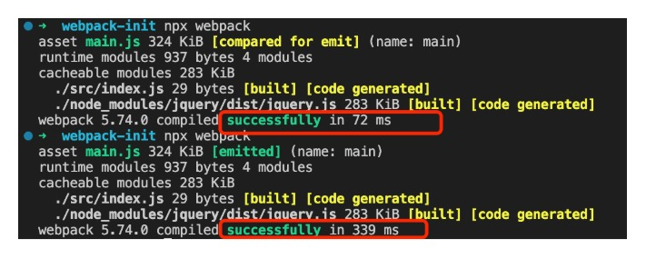
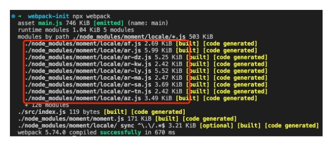

## 静态资源拷贝

[npm 地址](https://www.npmjs.com/package/copy-webpack-plugin)  
copy-webpack-plugin 主要实现对已有的文件拷贝，不需要 webpack 打包的文件  
`npm install copy-webpack-plugin --save-dev`

```js
const CopyWebpackPlugin = require('copy-webpack-plugin');
plugins: [
    new CopyWebpackPlugin([
      {
          from: 'public/*.js',  //从public文件下把所有的js文件  当然，我们需要在模板html中手动引用文件
          to: path.resolve(__dirname, 'dist'), // 拷贝到dist目录下
          flatten: true, //设置为 true，那么它只会拷贝文件，而不会把文件夹路径都拷贝上
          ignore: ['1.js'], // 过滤掉自己不想拷贝过去的文件
      },
      //还可以继续配置其它要拷贝的文件
  ])
  ],
```

## ProvidePlugin

[webpack 内置的模块](https://www.webpackjs.com/plugins/provide-plugin/)
自动加载模块，而可以不用到处用 import 和 require

```js
new webpack.ProvidePlugin({
  identifier: "module1",
  // ...
});
// 或者
new webpack.ProvidePlugin({
  identifier: ["module1", "property1"],
  // ...
});
```

```js
const webpack = require("webpack");
module.exports = {
  //...
  plugins: [
    new webpack.ProvidePlugin({
      React: "react",
      Component: ["react", "Component"],
      Vue: ["vue/dist/vue.esm.js", "default"],
      $: "jquery",
      _map: ["lodash", "map"],
    }),
  ],
};
// 每次使用的时候就不需要在引入文件可以直接使用，不推荐大量使用，不利于后面的人维护代码
```

## 按需加载

简单的说就是需要的时候才加载，不需要一开始就加载，有利于首屏优化

```js
document.getElementById("btn").onclick = function () {
  import("./handle").then((fn) => fn.default());
};
```

## 代码分割 splitChunks

[webpack 地址](https://webpack.js.org/plugins/split-chunks-plugin/#root)

默认配置

```js
module.exports = {
  //...
  optimization: {
    splitChunks: {  initial 同步  all 所有的
      chunks: 'async',// 默认支持异步代码分割 import()
      minSize: 30000, // 文件超过30k就会抽离
      minRemainingSize: 0,
      maxSize: 0,
      minChunks: 1, // 最少模块引用了一次
      maxAsyncRequests: 6, // 最多5个请求
      maxInitialRequests: 4, // 最多首屏加载4个请求
      automaticNameDelimiter: '~',
      cacheGroups: { //缓存组
        defaultVendors: {
          test: /[\\/]node_modules[\\/]/,
          priority: -10 //优先级
        },
        default: {
          minChunks: 2,
          priority: -20,//优先级
          reuseExistingChunk: true
        }
      }
    }
  }
};
```

## 删除无用 css 样式

```js
    npm i purify-webpack purify-css -D
    const glob = require('glob')
    const PurifyCssPlugin = require('purifycss-webpack')
    plugins: [
      new PurifyCssPlugin ({
          paths: glob.sync(path.join(__dirname, '/*.html'))
      })
    ]
```

## 删除 console.log

`npm i babel-plugin-transform-remove-console --save-dev`

```js
// .babelrc文件 或者babel.config.js  文件 配置
{
  "plugins": [
      ["transform-remove-console",
       // 保留 console.error 与 console.warn
       { "exclude":
        [ "error", "warn"]
       }
      ]
    ]
}
```

或者 需要 webpack4 以上

```js
const webpack = require('webpack');
const UglifyJsPlugin = require('uglifyjs-webpack-plugin')

module.exports = {
  optimization: {
    minimizer: [
      new UglifyJsPlugin({
        uglifyOptions: {
          compress: {
            warnings: false,
            drop_debugger: true,
            drop_console: true
          }
        }
      })
    ]
  }
```

## cdn 加载文件

    Externals     https://webpack.js.org/configuration/externals/#root
    在html文件引入不想被打包的cdn 例如jquery

```js
<script
  src="https://code.jquery.com/jquery-3.1.0.js"
  integrity="sha256-slogkvB1K3VOkzAI8QITxV3VzpOnkeNVsKvtkYLMjfk="
  crossorigin="anonymous"
></script>
```

webpack 配置

```js
module.exports = {
  //...
  externals: {
    jquery: "jQuery",
  },
};
```

这个时候我们就可以用 es6 语法或者 commonJS 或者 AMD 规范引用

```js
import $ from "jquery";

$(".my-element").animate(/* ... */);
```

只适用于很长时间不会更改的库

## Tree-shaking && Scope-Hoisting

### tree-shaking

[地址](https://www.webpackjs.com/guides/tree-shaking/#%E6%B7%BB%E5%8A%A0%E4%B8%80%E4%B8%AA%E9%80%9A%E7%94%A8%E6%A8%A1%E5%9D%97)  
 webpack 在 mode 为 production,并且使用 es6 语法`import`和`export`会自动删除没有使用的代码,  
 如果使用了 `optimize-css-assets-webpack-plugin`这个插件会导致原本 webpack 内置的对 js 的压缩失效， 这个时候需要自己手动去配置对 js 的压缩才会生效`UglifyJSPlugin`
tree-shaking 的必要条件

- 使用 ES2015 模块语法（即 import 和 export
- 在项目 package.json 文件中，添加一个 "sideEffects" 入口。
- 引入一个能够删除未引用代码(dead code)的压缩工具(minifier)（例如 UglifyJSPlugin）。

### scope-hoisting (作用域提升)

webpack3 以后的内置插件，必须使用 es6 语法引入的文件才会生效

```js
const ModuleConcatenationPlugin = require("webpack/lib/optimize/ModuleConcatenationPlugin");

module.exports = {
  plugins: [
    // 开启 Scope Hoisting
    new ModuleConcatenationPlugin(),
  ],
};
```

## noParse

noParse 主要的作用是过滤不需要解析的文件 比如打包的时候依赖性的三方库 jquery ｜ lodash 而这些三方库里没有其他依赖 可以通过配置 noParse 不去解析文件

配置也比较简单 参考如下

```js
const path = require("path");
module.exports = {
  mode: "development",
  entry: "./src/index.js",
  output: {
    path: path.resolve(__dirname, "dist"),
  },
  module: {
    noParse: /jquery｜lodash/,
  },
};
```

通过对比 可以发现 使用 noParse 和不使用 noParse 时间上还是差别很多的


## IgnorePlugin

忽略第三方包指定目录 让这些指定目录不被打包

我们以 moment 时间库为例子看一下
首先我们直接引入使用该库

```js
import moment from "moment";

moment.locale("zh-cn");

let time = moment().endOf("day").fromNow();

console.log(time);
```

然后打包 我们发现有很多我们不需要使用的语言包也一起被打包进去了



如果我们不想他们一起被打包 可以使用 IgnorePlugin 指定某些目录 不被打包

```js
const path = require("path");
let webpack = require("webpack");
module.exports = {
  mode: "development",
  entry: "./src/index.js",
  output: {
    path: path.resolve(__dirname, "dist"),
  },
  module: {
    noParse: /jquery/,
  },
  plugins: [
    // 忽略 moment 库中的 locale文件夹
    new webpack.IgnorePlugin({
      resourceRegExp: /^\.\/locale$/,
      contextRegExp: /moment$/,
    }),
  ],
};
```

再执行打包 可以看到 locale 文件就没有被打包 这里我就不贴图了 可以自己尝试一下
[对应 webpack 官网地址](https://webpack.js.org/plugins/ignore-plugin/#root)

需要注意的是 因为整个 locale 语言包都不被打包了 所以这个时候我们需要手动引入自己需要的语言包

```js
import moment from "moment";
// 手动引入语言包
import "moment/locale/zh-cn";
moment.locale("zh-cn");

let time = moment().endOf("day").fromNow();

console.log(time);
```

## DllPlugin && DllReferencePlugin

dll 其实本质上就是缓存，第一次打包，然后建立映射表，当后续打包先看映射表中有没有内容被缓存，如果有直接使用缓存，没有走正常的打包流程

看一下如何配置

可以新建一个 dll 文件

webpack.dll.js 配置如下

```js
const path = require("path");
const webpack = require("webpack");

module.exports = {
  mode: "development",
  entry: {
    react: ["react", "react-dom"],
  },
  // 这个是输出 dll 文件
  output: {
    path: path.resolve(__dirname, "dll"),
    filename: "_dll_[name].js",
    library: "_dll_[name]",
  },
  // 这个是输出映射表
  plugins: [
    new webpack.DllPlugin({
      context: __dirname,
      name: "_dll_[name]", // name === output.library
      path: path.resolve(__dirname, "dll/[name].manifest.json"),
    }),
  ],
};
```

webpack.config.js

```js
const path = require("path");
let webpack = require("webpack");
const HtmlWebpackPlugin = require("html-webpack-plugin");
module.exports = {
  mode: "development",
  entry: "./src/index.js",
  output: {
    path: path.resolve(__dirname, "dist"),
  },
  module: {
    noParse: /jquery/,
  },
  plugins: [
    new HtmlWebpackPlugin({ template: path.resolve("./public/index.html") }),
    // 忽略 moment 库中的 locale文件夹
    new webpack.IgnorePlugin({
      resourceRegExp: /^\.\/locale$/,
      contextRegExp: /moment$/,
    }),
    new webpack.DllReferencePlugin({
      context: __dirname,
      manifest: require("./dll/react.manifest.json"),
    }),
  ],
};
```

配置 package.json 文件打包命令

```js
"scripts": {
    "dll": "webpack --config webpack.dll.js"
  },
```

创建一个 dll 文件夹 执行 npm run dll 可以发现 dll 文件会有两个文件 一个 json 文件一个 js 文件
js 需要手动引入 在你的 index.html 模版里

现在 webpack 已经到 5 版本打包本身就很快 dll 配置 优化已经忽略不计了 所以这个配置 可有可无，不过这个思想还是值得学习一下

## include/exclude

webpack 在配置 loader 的时候可以 配置 include 或者 exclude 来提高打包效率
我们以 babel-loader 为例

```js
module: {
    noParse: /jquery/,
    rules: [
      {
        test: /\.js$/, // 代表指定项目中的所有js文件 包括 node_modules 中的
        exclude: /node_modules/, //排除那些文件 exclude优先级高于 include  两者同时存在且有效的情况是，exclude是include的子集
        include: path.resolve("src"), // 需要处理的 文件或者文件名  指定需要处理的文件是include对应的文件或者文件夹中符合test指定的类型的文件
        use: {
          loader: "babel-loader",
          options: {
            presets: ["@babel/preset-env", "@babel/preset-react"],
          },
        },
      },
    ],
```

## happypack

需要安装 happypack 模块

以 babel-loader 为例子

```js
module: {
  //模块
  rules: [
    //规则，多个loader
    {
      test: /\.js$/,
      use: {
        //用 babel-loader 把es6转es5
        loader: "babel-loader",
      },
    },
  ];
}
```

使用 happypack 后

```js
const Happypack = require("happypack"); //happypack 模块插件 可实现多线程打包

module.exports = {
  plugins: [
    //存放所有插件
    new Happypack({
      id: "js",
      use: [
        {
          //用 babel-loader 把es6转es5
          loader: "babel-loader",
        },
      ],
    }),
  ],
  module: {
    //模块
    rules: [
      //规则，多个loader
      {
        test: /\.js$/,
        use: "happypack/loader?id=js", //这里的js是指定id为js的happypack插件
      },
    ],
  },
};
```

happypack 在项目比较小的时候 反而会增加打包时间，所以不适合在小项目中使用
