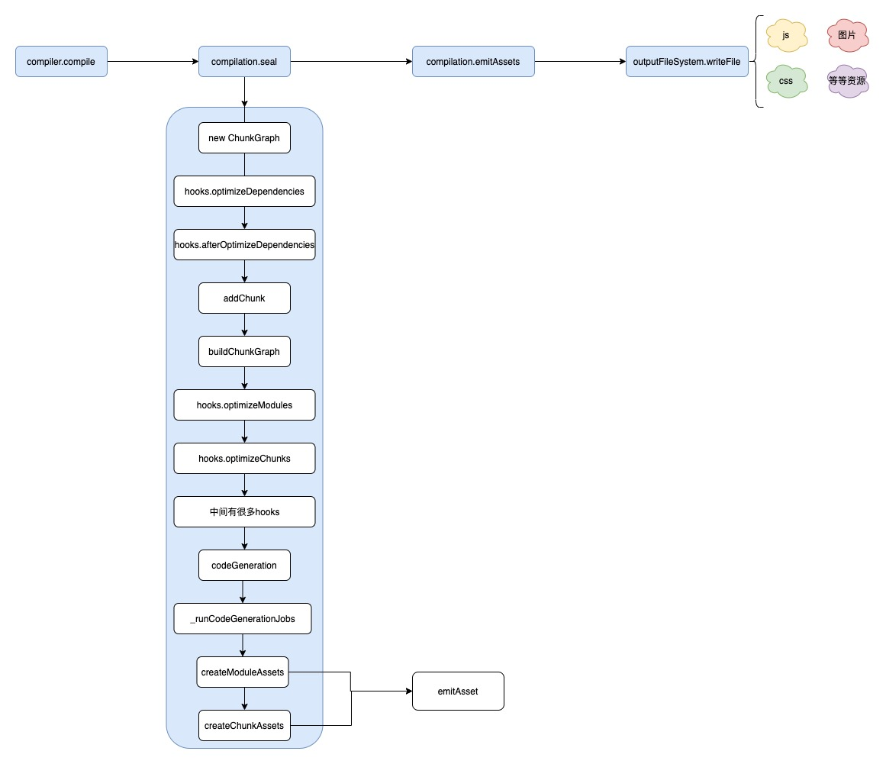

## webpack 构建流程概括

webpack 构建流程 可以分为 三大块


- 初始化：整合配置参数，创建 Compiler Compilation 等 并初始化插件以及一些工具类 并根据配置等 entry 入口，找到所有入口模块
- 构建：找到 entry 入口模块，调用 loader 将模块转译为 js 代码，调用第三方插件 Acorn 将代码转化成 AST 结构，遍历 AST 找出所有模块以及模块依赖的模块，遍历所有的资源后，构建模块依赖关系图
- 封装生成：将模块组装成一个个 chunk 对象，然后调用 template 翻译 chunk 代码 并封装为 Asset 最后写到文件系统

> 一次构建过程是自上而下的按顺序执行，如果启用了 watch 怎构建完不回退出 webpack 进程，而是持续监听文件内容，当内容发生变化时 回到构建阶段 重新执行

下面我们 分段看看 每个阶段做了什么事情

## 初始化


webpack 版本 5.74.0
webpack 初始化源码位置 webpack/webpack.js 142 行

这里描述 不会很全 只说主要流程原理 忽略部分细节

- 开始的时候合并 option 合并主要发生在 createCompiler 函数中
- 合并之后创建 Compiler 对象
- 遍历配置中的 plugins 执行 apply 方法
- 然后会触发两个 compiler 的钩子 environment 和 afterEnvironment
- 调用 `new WebpackOptionsApply().process(options, compiler)` 根据配置内容注入一些相关的插件 比如：
  - 调用 EntryOptionPlugin 这个插件会根据 entry 注入 DynamicEntryPlugin 或者 EntryPlugin
  - 注入 RuntimePlugin 用于根据代码内容动态注入 webpack 运行时代码
  - 根据 devtool 值 注入 sourcemap 插件
- 然后 createCompiler 会返回一个 compiler 之后执行 compiler.run() 方法
- 来到 webpack/Compiler.js 文件 寻找 run 方法（424 行）
- run 方法 主要是执行了 compile 方法 开始构建

```js
	compile(callback) {
		const params = this.newCompilationParams();
		this.hooks.beforeCompile.callAsync(params, err => {
            // 忽略一部分代码
			const compilation = this.newCompilation(params);
			this.hooks.make.callAsync(compilation, err => {
				 // 忽略一部分代码
				this.hooks.finishMake.callAsync(compilation, err => {
					// 忽略一部分代码
					process.nextTick(() => {

						compilation.finish(err => {
							// 忽略一部分代码
							compilation.seal(err => {
								// 忽略一部分代码
								this.hooks.afterCompile.callAsync(compilation, err => {
									logger.timeEnd("afterCompile hook");
									if (err) return callback(err);
									return callback(null, compilation);
								});
							});
						});
					});
				});
			});
		});
	}
```

本身这个函数也没有一些实质性的操作 只是触发了一些 钩子

## AsyncQueue

任务调度器 在构建阶段 用到了 AsyncQueue，最主要的作用是 每个任务都会基于 processor 函数来处理 得到后的结果

[更加详细的请参考这个 AsyncQueue](https://cloud.tencent.com/developer/article/1948126)

## 构建


make.callAsync 触发 entryPlugin

EntryPlugin.js 47 行 `make.tapAsync("EntryPlugin"`, 监听 然后执行 `compilation.addEntry`

Compilation.js 2105 执行 addEntry 函数 2112 行 执行 `_addEntryItem`函数 然后 2181 行 执行 `addModuleTree`

添加模块树 执行 `handleModuleCreation` 函数 然后来到 `factorizeModule` 函数 `factorizeModule 是挂载在 Compilation 原型商的一个方法

收集队列 factorizeQueue 收集的时候 会执行 `_factorizeModule` 函数 然后执行 `factory.create` 函数

> factory 是什么？

factory 是 `_factorizeModule` 接收的参数 我们看看来源是哪个地方 他的上一级参数 来自 `factorizeModule` 再上一级 是 `handleModuleCreation` 接收的参数 再上一级 `const moduleFactory = this.dependencyFactories.get(Dep);` 因为 `dependencyFactories` 是个 map 在 EntryPlugin.js 中 已经把 `normalModuleFactory` 设置进入了 所以 根据 key 去取 如下代码 所以 这个 factory 是 `normalModuleFactory`

```js
compiler.hooks.compilation.tap(
  "EntryPlugin",
  (compilation, { normalModuleFactory }) => {
    compilation.dependencyFactories.set(EntryDependency, normalModuleFactory);
  }
);
```

）

接下来 来到 NormalModuleFactory.js 执行 create 函数 740 行
然后触发了两个钩子 `this.hooks.beforeResolve.callAsync`
`this.hooks.factorize.callAsync`
`this.hooks.factorize.tapAsync` 主要功能创建了一个 module 并返回 就是下面代码中的 module
然后触发回调函数 返回了一个对象

```js
const factoryResult = {
  module,
  fileDependencies,
  missingDependencies,
  contextDependencies,
  cacheable: resolveData.cacheable,
};

callback(null, factoryResult);
```

然后执行 回调 看 1774 行 然后 执行 `this.addModule`

添加模块队列 `this.addModuleQueue` 每次添加 会执行 `_addModule` 函数 模块收集

然后执行 callback 这个 callback 来自 1810 行的函数 然后执行 然后执行 `this._handleModuleBuildAndDependencies`

然后 走到 `buildModule` 收集 `this.buildQueue` build 队列 然后每次收集的时候 执行 ` _buildModule`函数 然后执行 `module.build`

> 问题来了 这个 module 是什么 module ？

找一下 来源 首先 `buildModule` 接收了 module 再上一级 `_handleModuleBuildAndDependencies`函数接收了 module 再上一级
然后发现 这个 module 来自 `_addModule` 函数 执行的 callback 传入了 一个 module 然后 这个 module 来自 `addModule` 的 接收的 module

1810 行 接收了一个 newModule 然后 这个 `newModule` 来自 `factoryResult.module` 然后 `factoryResult` 来自 NormalModuleFactory.js 中 返回的一个回调 看上面的代码 然后 这个 module 来自 NormalModuleFactory.js 309 行 `createdModule = new NormalModule(createData);`
所以我们发现 这个 module 是 NormalModule.js

来到 NormalModule.js 执行 build 方法 936 行 然后这个函数 执行了 `this._doBuild` 函数 这个函数 执行了 runLoaders ，runLoaders 主要是转译 module 内容 ，将各种资源转译成 webpack 能够理解的标准的 js 文本

build 第一步 `runloaders`
`processResult `处理转化后的结果 得到 source 源代码 之后要把源代码转化成 ast
`this.parser.parse parse` 就是把代码转化成 ast

参考 NormalModule.js 1085 行

```js
let result;
try {
  const source = this._source.source();
  result = this.parser.parse(this._ast || source, {
    source,
    current: this,
    module: this,
    compilation: compilation,
    options: options,
  });
} catch (e) {
  handleParseError(e);
  return;
}
handleParseResult(result);
```

这个 this.parser 来源 没有找到，看了一些文章 主要是说 来自 javascript/JavascriptParser.js 但是都没有说 引入来源

在 JavaScriptParser 类中遍历 AST，触发各种钩子，其中最关键的

- 遇到 import 语句时，触发 exportImportSpecifier 钩子；
- HarmonyExportDependencyParserPlugin 监听该钩子，将依赖资源添加为 Dependency 对象；
- 调用 module 对象的 addDependency， 将 Dependency 对象转换为 Module 对象并添加到依赖数组中。
- AST 遍历完毕后，调用 module.handleParseResult 处理模块依赖数组
- 对于 module 新增的依赖，调用 handleModuleCreate，控制流回到第一步；

过程中模块源码经历了 module => ast => dependences => module 的流转，先将源码解析为 AST 结构，再在 AST 中遍历 import 等模块导入语句，收集模块依赖数组 —— dependences，最后遍历 dependences 数组将 Dependency 转换为 Module 对象，之后递归处理这些新的 Module，直到所有项目文件处理完毕。

这个过程会调用 acorn 将模块内容 —— 包括 JS、CSS，甚至多媒体文件，解析为 AST 结构，所以需要使用 loaders 将不同类型的资源转译为标准 JavaScript 代码。

## 封装

封装生成阶段主要是读入和分析源码文件 ，然后整合资源，make 执行完毕就会执行 seal 函数

```js
compile(callback) {
			this.hooks.make.callAsync(compilation, err => {
				 // 忽略一部分代码

						compilation.finish(err => {
							// 忽略一部分代码
							compilation.seal(err => {
								// 忽略一部分代码
							});
						});
					});
           });
```

seal 函数是 封装生成阶段的入口，将模块封装进 Chunk 中



看上面的流程图，我们大致介绍一下 各阶段的方法函数钩子的作用

- 开始创建一个 ChunkGraph 对象
- 遍历入口集合 entries、
  - 调用 addChunk 为每个入口创建一个 chunk 对象
  - 遍历该入口对应的 dependency 集合 找到相对应的 Module 对象 并关联该 chunk
- 得到了很多 chunk 之后调用 buildChunkGraph 将这些 chunk 处理成 图的结构 方便后面处理
- 然后触发了一些 hooks 钩子 optimizeModules/optimizeChunks 等 这些钩子都是用来处理和优化 chunk 的结构
- optimizeChunkModules 当这个钩子执行完毕 调用 codeGeneration 方法 生成 chunk 代码
  - 每遍历一个 chunk 的 module 对象 就会调用 \_runCodeGenerationJobs 方法
  - \_runCodeGenerationJobs 会继续调用 codeGeneration 生成单个 Module 的代码
- 当所有的 Module 都执行完 codeGeneration 生产模块资产代码， 然后开始调用 createChunkAssets 函数 为每个 Chunk 生成资产文件
- 然后再调用 emitAsset 函数 提交资产文件
- 所有操作完成后 触发回调 然后调用 emitAssets 输出资产文件 `outputFileSystem.writeFile`

## 总结

最后总结一下

- compiler.make 阶段：
  - entry 文件以 dependence 对象形式加入 compilation 的依赖列表，dependence 对象记录了 entry 的类型、路径等信息；
  - 根据 dependence 调用对应的工厂函数创建 module 对象，之后读入 module 对应的文件内容，调用 loader-runner 对内容做转化，转化结果若有其它依赖则继续读入依赖资源，重复此过程直到所有依赖均被转化为 module。
- compilation.seal 阶段：
  - 遍历 module 集合，根据 entry 配置及引入资源的方式，将 module 分配到不同的 Chunk；
    Chunk 之间最终形成 ChunkGraph 结构；
  - 遍历 ChunkGraph，调用 compilation.emitAsset 方法标记 chunk 的输出规则，即转化为 assets 集合。
- compiler.emitAssets 阶段：
  将 assets 写入文件系统。
