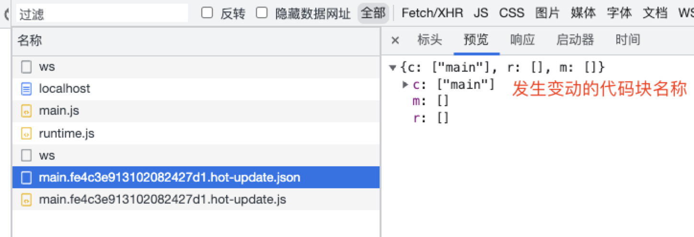
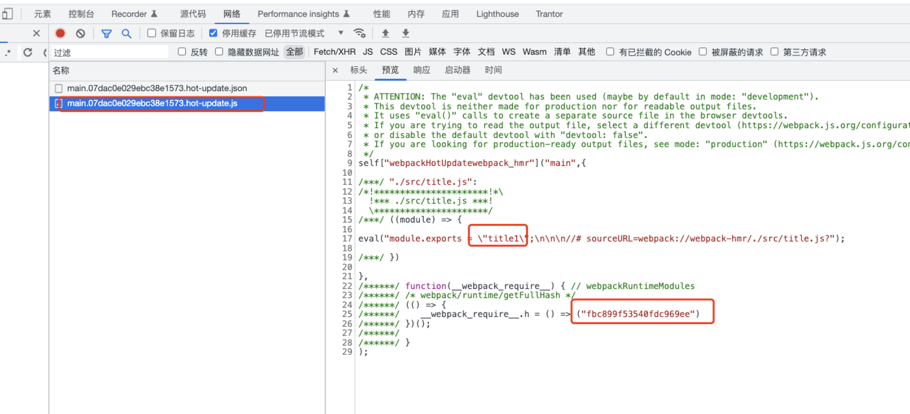
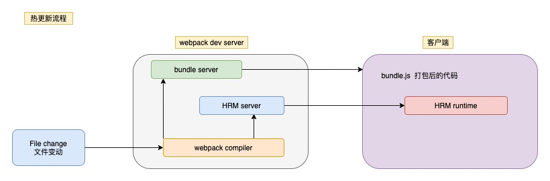
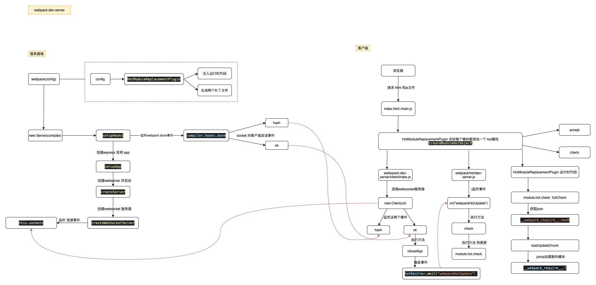

## 什么是热更新（HMR）

Hot Module Replacement 是指当我们对代码修改并保存后，webpack 将会对代码进行重新打包，并将新的模块发送到浏览器端，浏览器会用新的模块替换旧的模块，在实现不刷新浏览器的前提下更新页面

## 基本的使用

新建一个项目 安装 一些插件

```js
npm i webpack webpack-cli webpack-dev-server html-webpack-plugin socket.io --save-dev
```

webpack.config.js

```js
let path = require("path");
let webpack = require("webpack");
let HtmlWebpackPlugin = require("html-webpack-plugin");

module.exports = {
  mode: "development",
  entry: "./src/index.js",
  output: {
    filename: "[name].js",
    path: path.resolve(__dirname, "dist"),
  },
  devServer: {
    hot: true,
  },
  plugins: [new HtmlWebpackPlugin(), new webpack.HotModuleReplacementPlugin()],
};
```

index.js

```js
let input = document.createElement("input");
document.body.appendChild(input);

let div = document.createElement("div");
document.body.appendChild(div);

let render = () => {
  let title = require("./title");
  div.innerHTML = title;
};
render();

// 如果当前模块支持热更新的话
if (module.hot) {
  // 注册回调，当前index.js模块 可以接受 title.js 的变更 当title.js变更后 可以重新调用render方法
  module.hot.accept(["./title.js"], render);
}
```

title.js

```js
module.exports = "title";
```

这就是基本的用法，当我们开发的时候 修改 title 文件内容 可以发现 浏览器并没有刷新 内容也发生了变更

## 一些基础知识

1. module（模块）和 chunk

- 在 webpack 里有很多模块 一个文件就是一个模块
- 一般一个入口会依赖多个模块
- 一个入口一般会对应一个 chunk，这个 chunk 包含这个入口依赖的所有模块

2. HotModuleReplacementPlugin

- webpack/lib/HotModuleReplacementPlugin.js
- 它会生成两个补丁文件
  - 上一次编译生成的 hash.hot-update.json 说明从上次到现在哪些模块改变了
  - chunk 名称，上一次编译生成的 hash.hot-update.js 存放此代码块最新的模块定义 里面会调用 webpackHotUpdate 方法
  - 向代码块中注入 HMR runtime 代码 热更新的逻辑，比如：拉取代码 执行代码 执行 accept 回调都是它注入到 chunk 中的

3. hash.hot-update.json



> 在 Webpack 4 及之前，热更新文件以模块为单位，即所有发生变化的模块都会生成对应的热更新文件； Webpack 5 之后热更新文件以 chunk 为单位，如上例中，main chunk 下任意文件的变化都只会生成 main.[hash].hot-update.js 更新文件。



js 文件 就是本次修改的代码，并且里面还包含本次更新的 hash 值，这个 hash 值就是下次热更新的 hash 值

## 原理



相关概念介绍

- bundle.js 构建输出的文件
- bundle server 启动一个服务 浏览器可以通过 localhost 访问页面
- HRM server 将热更新文件 输出给 HRM runtime
- HRM runtime 在打包的时候注入一些代码到 bundle.js 中
- webpack compiler webpack 编译器，将 js 编译成 bundle 文件

普通话描述一遍：

#### 启动时

当项目启动的时候，文件经过 webpack compiler 编译，如果开始热更新的话，compiler 会调用 HotModuleReplacementPlugin 插件向应用的 chunk 注入一些 HRM runtime

比如

- WebSocket 的连接 处理 hash 等消息的通知
- 加载热更新资源
- 处理模块更新 module.hot.accept 接口等

HotModuleReplacementPlugin 源码位置 webpack/lib/HotModuleReplacementPlugin.js

注入代码后 启动 server 这个 server 主要是让浏览器可以访问我们打包后的文件

#### 热更新时

当有文件发生变更，webpack compiler 编译后传输给 HRM server ，HRM server 知道那个 chunk 发生了变更 然后通知 HRM runtime，HRM runtime 会通过 JSONP 的方式加载对应的代码，代码加载完毕然后触发回调 更新内容

## 相关源码位置

webpack-dev-server 版本号 4.11.1

- bundle server 启动位置

  webpack-dev-server/lib/Server.js
  初始化一个 express 服务 让浏览器可以请求本地的静态资源

```js
  setupApp() {
    /** @type {import("express").Application | undefined}*/
    // eslint-disable-next-line new-cap
    this.app = new /** @type {any} */ (express)();
  }
```

- HRM Server

  webpack-dev-server/lib/Server.js 2482 行

```js
 createWebSocketServer() {
    // 启动 HRM server
    this.webSocketServer = new (this.getServerTransport())(this);
    (this.webSocketServer).implementation.on(
      "connection",
      (client, request) => {
        const headers = typeof request !== "undefined"
            ? (request.headers)
            : typeof ((client).headers) !== "undefined"
            ?  (client).headers: undefined;

            // 忽略一部分代码

        this.sendStats([client], this.getStats(this.stats), true);
      }
    );
  }
```

- HRM Server 和 HRM Runtime 通信

通过 webpack 创建 compiler 的实例，可以向 compiler 钩子注册一些事件，监听 webpack 编译过程

webpack-dev-server/lib/Server.js 1901 行

```js
  setupHooks() {
    this.compiler.hooks.invalid.tap("webpack-dev-server", () => {
      if (this.webSocketServer) {
        this.sendMessage(this.webSocketServer.clients, "invalid");
      }
    });
    // done 代表编译结束
    this.compiler.hooks.done.tap(
      "webpack-dev-server",
      (stats) => {
        if (this.webSocketServer) {
          // 编译结束 调用 sendStats方法
          this.sendStats(this.webSocketServer.clients, this.getStats(stats));
        }
        this.stats = stats;
      }
    );
  }

```

看一下 sendStats 方法的作用

sendStats 主要是发送 hash 和 ok 事件
webpack-dev-server/lib/Server.js 3106 行

```js
// 只保留了关键代码 其他代码删除了
 sendStats(clients, stats, force) {
    this.currentHash = stats.hash;
    this.sendMessage(clients, "hash", stats.hash);
    if () {
    } else {
      this.sendMessage(clients, "ok");
    }
  }

// sendMessage 就是个中转 触发 websocket 的注册的事件方法
  sendMessage(clients, type, data, params) {
    for (const client of clients) {
      if (client.readyState === 1) {
        client.send(JSON.stringify({ type, data, params }));
      }
    }
  }
```

在 `webpack-dev-server/client/index.js`中 会触发 hash 和 ok

```js
// 这里简化了代码 只提取了部分
var onSocketMessage = {
  hot: function hot() {
    if (parsedResourceQuery.hot === "false") {
      return;
    }

    options.hot = true;
  },
  // 更新hash值
  hash: function hash(_hash) {
    status.previousHash = status.currentHash;
    status.currentHash = _hash;
  },
  ok: function ok() {
    sendMessage("Ok");

    if (options.overlay) {
      hide();
    }
    // 更新检查
    reloadApp(options, status);
  },
};
```

看一下 reloadApp 主要做了什么
文件位置 webpack-dev-server/client/utils/reloadApp.js

```js
function reloadApp(_ref, status) {
  if (hot && allowToHot) {
    // 用node的EventEmitter 去触发 webpack 的 webpackHotUpdate方法
    hotEmitter.emit("webpackHotUpdate", status.currentHash);
    if (typeof self !== "undefined" && self.window) {
      self.postMessage("webpackHotUpdate".concat(status.currentHash), "*");
    }
  }
}
```

webpack/hot/dev-server.js

监听 webpackHotUpdate 方法 然后执行 check 方法 在 check 中调用 `module.hot.check`热更新

```js
if (module.hot) {
	var lastHash;
	var upToDate = function upToDate() {
		return lastHash.indexOf(__webpack_hash__) >= 0;
	};
	var log = require("./log");
	var check = function check() {
    // 开始热更新
		module.hot
			.check(true)
			.then(function (updatedModules) {
				if (!updatedModules) {
					window.location.reload();
					return;
				}
				if (!upToDate()) {
					check();
				}
				require("./log-apply-result")(updatedModules, updatedModules);
			})
			.catch(function (err) {
				var status = module.hot.status();
				if (["abort", "fail"].indexOf(status) >= 0) {
					window.location.reload();
			});
	};
	var hotEmitter = require("./emitter");
  // 监听事件
	hotEmitter.on("webpackHotUpdate", function (currentHash) {
		lastHash = currentHash;
		if (!upToDate() && module.hot.status() === "idle") {
			check();
		}
	});
}
```

- 看下开始热更新后 打包后的代码

也就是 HRM runtime 的代码

搜索打包后的代码 createModuleHotObject 会发现 一个调用的方法，上面提到的 `module.hot.check`
就是调用 createModuleHotObject 的 hotCheck 方法

```js
module.hot = createModuleHotObject(options.id, module);
```

```js
// 代码很长 只保留了部分代码
function createModuleHotObject(moduleId, me) {
  var _main = currentChildModule !== moduleId;
  var hot = {
    // private stuff
    _acceptedDependencies: {},
    _acceptedErrorHandlers: {},
    _declinedDependencies: {},
    _selfAccepted: false,
    _selfDeclined: false,
    _selfInvalidated: false,
    _disposeHandlers: [],
    _main: _main,
    _requireSelf: function () {
      currentParents = me.parents.slice();
      currentChildModule = _main ? undefined : moduleId;
      __webpack_require__(moduleId);
    },

    // Module API
    active: true,
    accept: function (dep, callback, errorHandler) {
      if (dep === undefined) hot._selfAccepted = true;
      else if (typeof dep === "function") hot._selfAccepted = dep;
      else if (typeof dep === "object" && dep !== null) {
        for (var i = 0; i < dep.length; i++) {
          hot._acceptedDependencies[dep[i]] = callback || function () {};
          hot._acceptedErrorHandlers[dep[i]] = errorHandler;
        }
      } else {
        hot._acceptedDependencies[dep] = callback || function () {};
        hot._acceptedErrorHandlers[dep] = errorHandler;
      }
    },
    // Management API
    check: hotCheck,
    apply: hotApply,
    //inherit from previous dispose call
    data: currentModuleData[moduleId],
  };
  currentChildModule = undefined;
  return hot;
}
```

看下 hotCheck 函数做了什么事情
调用了 `__webpack_require__.hmrM` 方法

```js
function hotCheck(applyOnUpdate) {
  return setStatus("check")
    .then(__webpack_require__.hmrM)
    .then(function (update) {
      if (!update) {
        return setStatus(applyInvalidatedModules() ? "ready" : "idle").then(
          function () {
            return null;
          }
        );
      }
    });
}
```

`__webpack_require__.hmrM`主要是去加载 hot-update.json 文件
`__webpack_require__.p` 获取本地服务域名
`__webpack_require__.hmrF()` 获取 json 文件
`__webpack_require__.hmrF = () => ("main." + __webpack_require__.h() + ".hot-update.json")`

```js
__webpack_require__.hmrM = () => {
  return fetch(__webpack_require__.p + __webpack_require__.hmrF()).then(
    (response) => {
      if (response.status === 404) return; // no update available
      if (!response.ok)
        throw new Error(
          "Failed to fetch update manifest " + response.statusText
        );
      return response.json();
    }
  );
};
```

加载更新模块 主要是 执行 loadUpdateChunk 函数 的 `__webpack_require__.l`

```js
// 主要是通过jsonp 去加载新的模块 然后执行回调
__webpack_require__.l = (url, done, key, chunkId) => {
  ...
  if (!script) {
    needAttach = true;
    script = document.createElement("script");

    script.charset = "utf-8";
    script.timeout = 120;
    if (__webpack_require__.nc) {
      script.setAttribute("nonce", __webpack_require__.nc);
    }
    script.setAttribute("data-webpack", dataWebpackPrefix + key);
    script.src = url;
  }
  ...
  needAttach && document.head.appendChild(script);
};
```

所以，客户端接受到服务器端推动的消息后，如果需要热更新，浏览器发起 http 请求去服务器端获取新的模块资源解析并局部刷新页面

最后看下整体的流程图 中间省略了一些步骤 只画出的主要的步骤


