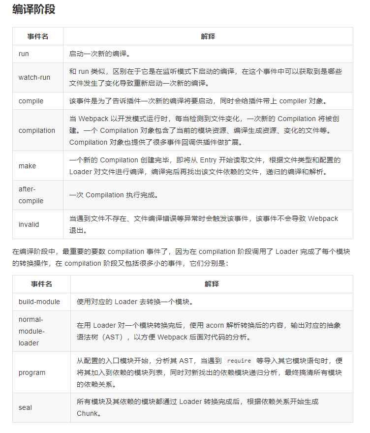

## 基本概念

- entry: 入口，webpack 执行构建的第一步将从 entry 开始
- module: 模块，在 webpack 中一切都是模块，一个模块对应一个文件，webpack 会从配置的 entry 开始递归查找所有依赖的模块
- chunk: 代码块 一个 chunk 由多个模块组合而成，用于代码合并和分割
- loader: 模块转换器，用于把模块原有内容按照需求转化成新的内容
- plugin: 插件，在 webpack 构建流程中的特定时机广播出对应的事件，插件可以监听这些事件，然后处理相应的逻辑

## webpack 编译的大致流程

- 初始化数据，从配置文件和 shell 语句中读取与合并参数，得出最终的参数
- 开始编译：用上一步得到的参数初始化 compiler 对象，加载所有的配置插件（plugin），执行对象的 run 方法开始编译
- 确定入口文件：根据配置 entry 找出所有的入口文件
- 编译模块: 从入口文件出发，调用所有的配置 loader 对模块进行翻译，再找出该模块所依赖的模块，依次递归，直到所有的入口文件都经过这一步骤的处理
- 完成编译：完成 loader 翻译后的模块后，得出被翻译后的内容之间的依赖关系
- 输出资源：根据入口和模块之间的依赖关系，组装成一个个包含多个模块的 chunk,再把每个 chunk 转化成一个单独的文件加入到输出列表
- 输出完成：在确定好内容后，根据配置确定输出的路径和文件名，把文件内容写入到文件系统

## 相关细节

- 初始化：启动构建，读取与合并配置参数，加载 Plugin，实例化 Compiler。
- 编译：从 Entry 发出，针对每个 Module 串行调用对应的 Loader 去翻译文件内容，再找到该 Module 依赖的 Module，递归地进行编译处理。
- 输出：对编译后的 Module 组合成 Chunk，把 Chunk 转换成文件，输出到文件系统。

