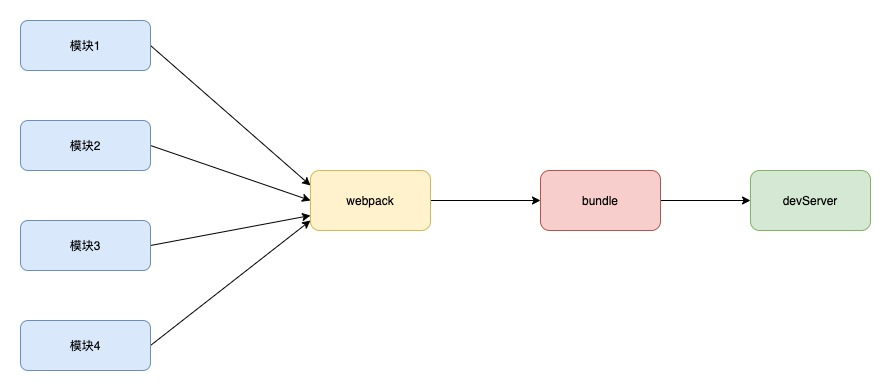
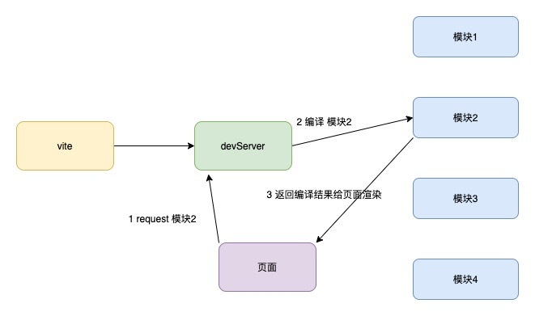

## webpack 和 vite 的区别

webpack 打包原理

vite 打包原理

- webpack 会先把所有模块打包，然后启动开发服务器，请求服务器资源的时候直接给打包后的结果。
- vite 是直接启动开发服务器，请求哪个模块，再对哪个模块进行打包编译。

因为现代浏览器都支持 ESModule，会自动向依赖的模块发起请求，因为 vite 打包的时候不需要编译，只启动了服务器，所以 vite 启动速度是非常快的，
当浏览器对某个模块请求时，再对该模块进行编译，这种按需编译的方式，可以很大程度上缩减了编译时间。项目越复杂 优势越明显

热更新的时候，也是重新编译改动的模块即可，不像 webpack 需要把所有的相关依赖都重新编译

打包生产 vite 使用的是 rollup 进行打包

因为 vite 主要是利用 ESModule 原理 所以在代码里不能使用 CommonJS 规范 。
